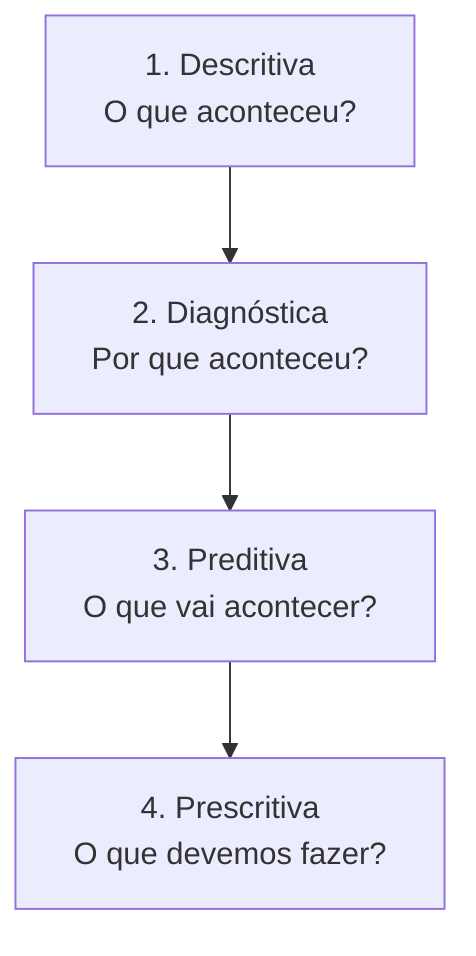
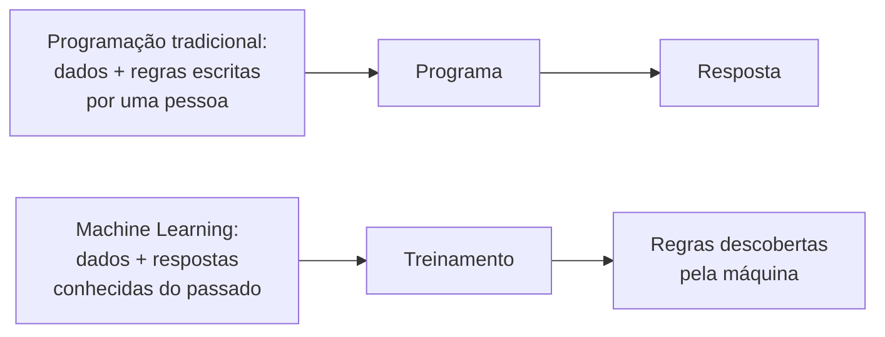

# Aula 1 — A Evolução da Análise de Dados

Uma pizzaria precisa decidir, toda manhã, quanta massa deixar pronta para o almoço. Se sobrar, vai para o lixo. Se faltar, a casa perde vendas na hora de maior movimento.

Dá para tomar essa decisão de dois jeitos. O dono pode olhar para o teto e chutar. Ou pode abrir o histórico de vendas e contar quantas pizzas saíram nos últimos almoços.

O segundo jeito tem nome: análise de dados. Esta aula conta como ele saiu de relatórios impressos que demoravam três dias para chegar a modelos que respondem em segundos.


Ao longo do curso vamos tratar como parentes próximos os termos *Análise de Dados*, *Business Intelligence*, *Analytics*, *Ciência de Dados*, *Inteligência Artificial* e *Machine Learning*. Existem diferenças reais entre eles, mas todos respondem à mesma pergunta: como usar dados para resolver problemas.

* *Análise de Dados* é o termo mais geral.
* *Business Intelligence* é análise de dados aplicada a um negócio.
* *Ciência de Dados* é análise de dados com técnicas mais avançadas.
* *Inteligência Artificial* é o guarda-chuva; *Machine Learning* é a subárea que domina a prática hoje.


## Decidir com dados ou decidir no escuro

Durante muito tempo, quem tocava um negócio decidia pela intuição. Funcionava enquanto o negócio era pequeno e o dono via tudo de perto.

Business Intelligence é o conjunto de práticas e sistemas que junta os dados espalhados pela empresa e os apresenta de um jeito que qualquer pessoa consegue ler. Não é um software. É um método que termina em decisão.

Um exemplo com a planilha que vamos usar no curso. A pizzaria registra o horário de cada venda no sistema do caixa, e ninguém nunca olhou para essa coluna. Ao agrupar vinte meses de vendas por hora do dia, aparece um padrão nítido: 26,6% das pizzas saem entre meio-dia e duas da tarde, e o pico é às 12h. A partir daí, a escala da equipe do almoço passa a ser uma decisão, e não uma improvisação.

O objetivo do BI é esse: tirar a decisão do "eu acho" e colocá-la em cima de evidência que qualquer um pode conferir.

## Três eras, o mesmo problema

A pergunta nunca mudou — "o que os dados dizem?". O que mudou foi quem consegue respondê-la e em quanto tempo.

## A era do relatório que demorava três dias

Nos anos 1970 e 1980, os dados moravam em computadores de grande porte controlados pelo departamento de tecnologia. Para conseguir um número, o gerente abria um chamado e esperava.

Quem sabia extrair a informação era um programador. O gerente que queria saber quais sabores mais venderam no mês pedia o relatório na segunda-feira e recebia uma pilha de papel na quinta. Se o número viesse errado, era mais uma semana.

Havia poucos dados perto do que existe hoje, mas esses relatórios impressionavam. Pela primeira vez, decisões de estoque e preço saíam de um cálculo, e não de um palpite.

## A era do "faça você mesmo"

Nos anos 2000 chegaram as ferramentas de *self-service*: Excel, Power BI, Tableau, Google Planilhas. O analista de negócios passou a montar o próprio relatório sem pedir nada para a TI.

Na prática, isso significa que a pessoa que conhece o problema é a mesma que fatia os dados. O gerente da pizzaria abre a planilha de vendas, filtra pelo mês passado, agrupa por sabor e tem a resposta em cinco minutos. Esse "fatiar e girar" é o que o mercado chama de *slice and dice*.

A autonomia veio junto com um problema. Com a internet, o volume de dados cresceu numa escala que nenhuma empresa tinha visto antes. Sobraram dados e faltou gente preparada para analisá-los.

## A era do BI com Inteligência Artificial

A IA não veio substituir o BI. Veio tirar dele duas limitações antigas.

A primeira é a barreira da linguagem. Antes, para perguntar algo aos dados era preciso saber montar uma fórmula ou uma consulta. Hoje o gerente digita "qual sabor caiu mais nos últimos três meses?" e recebe a resposta com o gráfico junto.

A segunda é o tipo de dado. O BI clássico só lia tabelas. A IA lê texto em PDF, imagem e áudio — material que nunca coube em linha e coluna. Na pizzaria, isso significa ler os 5.000 comentários que os clientes deixaram no aplicativo e descobrir que "pizza chegou fria" é a reclamação número um do bairro vizinho.

Essa combinação tem nome: **Inteligência de Decisão** (*Decision Intelligence*). O BI mostra o que aconteceu; a IA sugere o que fazer; a decisão continua sendo de uma pessoa.

## Os quatro degraus da análise

O instituto Gartner descreve a maturidade analítica como uma escada. Cada degrau responde a uma pergunta diferente e vale mais que o anterior.

**Descritiva** olha para o passado e conta. Exemplo: em julho, 12% dos clientes cadastrados não fizeram nenhum pedido.

**Diagnóstica** procura a causa. Exemplo: cruzando os pedidos com o tempo de entrega, descobrimos que quase todos os clientes que sumiram tinham recebido uma entrega com mais de 50 minutos de atraso.

**Preditiva** usa o passado para estimar o futuro. Exemplo: um cliente que sofreu dois atrasos seguidos tem 85% de chance de não pedir de novo no mês seguinte.

**Prescritiva** recomenda a ação. Exemplo: assim que o sistema registra o segundo atraso, ele dispara um cupom de desconto para aquele cliente antes que ele desista.

Repare que os dois primeiros degraus explicam o passado e os dois últimos mexem no futuro. A maior parte das empresas ainda vive no primeiro degrau.

## Como a máquina aprende

Vale desmontar um mito antes de seguir. A IA dos filmes — um robô consciente, que pensa como gente — não existe. Ela tem até nome técnico: IA geral.

O que existe nas empresas é a **IA estreita**: um modelo treinado para resolver um problema só, com boa precisão. Um modelo que prevê a demanda de massa não sabe fazer mais nada. Nem responder que horas são.

A diferença entre programar e treinar está na direção da lógica:

No modelo tradicional, alguém escreve a regra: "no almoço, prepare 20% mais massa". No *machine learning*, mostramos ao computador os 358 dias de operação que a planilha registra, com a quantidade que saiu em cada um, e ele descobre sozinho qual é o padrão — inclusive coisas que ninguém pensou em escrever, como o efeito de chover.

Isso acontece em duas fases. No **treinamento**, o modelo estuda os exemplos antigos e ajusta seus cálculos. Na **inferência**, chega um dia novo e ele devolve uma previsão: 140 pizzas.

## Os quatro Vs: a matéria-prima importa

Se os dados que entram são ruins, a resposta que sai é ruim. Não existe modelo que conserte isso. Para avaliar se os dados servem, olhe quatro características.

**Volume** — quantidade suficiente de registros. Prever a demanda do almoço com três semanas de histórico não dá; com dois anos, dá.

**Variedade** — diversidade de formatos. Vendas em tabela, comentários em texto, fotos das entregas. Quanto mais ângulos, mais rica a leitura — e mais trabalho para preparar os dados, porque nada disso chega pronto para análise.

**Velocidade** — o ritmo em que o dado é produzido e precisa ser processado. O caixa gera pedidos o dia inteiro; se o painel só carrega uma vez por semana, você decide sempre com o mundo de sete dias atrás. E um modelo treinado com os preços de 2023 vai errar em 2026, porque o cardápio mudou. Esse envelhecimento tem nome: *data drift*.

**Veracidade** — dados confiáveis e corretamente etiquetados. Se metade dos pedidos de tamanho G foi registrada como M por engano no caixa, nenhuma análise de tamanho vai prestar.


Na prática, a Veracidade é a que mais derruba projeto. É comum descobrir, já no meio da análise, que uma coluna inteira foi preenchida errado durante meses. Antes de qualquer conta, olhe os dados brutos com os próprios olhos.


## Construir, alugar ou montar

Nenhuma empresa precisa criar sua IA do zero. Existem três caminhos, do mais pronto ao mais trabalhoso.

| Caminho | O que é | Exemplo na pizzaria |
| --- | --- | --- |
| **IA como serviço** (AIaaS) | Ferramenta pronta, alugada pela internet | Contratar um serviço que classifica automaticamente os comentários como elogio ou reclamação |
| **Plataforma como serviço** (PaaS / AutoML) | Ambiente onde você treina um modelo com os seus dados, sem programar do zero | Subir a planilha de vendas e pedir à plataforma um modelo de previsão de demanda |
| **Infraestrutura como serviço** (IaaS) | Servidores alugados, com o modelo construído e controlado pela empresa | Só faz sentido para uma rede com centenas de lojas e time de dados próprio |

A regra prática é descer na tabela só quando o caminho de cima não resolve. Comprar pronto custa menos e entrega em dias; construir custa caro e entrega em meses.

## O profissional que a IA não substitui

A tecnologia deixou de ser o gargalo. O gargalo hoje é humano, e aparece na dificuldade de duas turmas conversarem: a do BI, que organiza indicadores e metas, e a da ciência de dados, que constrói algoritmos e faz experimentos.

Quem trabalha com dados não precisa temer a automação. A IA assume a parte repetitiva — juntar planilha, formatar relatório, procurar erro de digitação — e devolve tempo para a parte que exige julgamento: escolher a pergunta certa e decidir o que fazer com a resposta.

> "A IA em si não está substituindo nossos empregos. O que acontece é que as pessoas que sabem aproveitar a IA estão entrando nas organizações e mudando o status quo."
> — Tobias Zwingmann, *AI-Powered Business Intelligence*

Nas próximas aulas vamos fazer exatamente isso: pegar a planilha de vendas de uma pizzaria de verdade e transformá-la em respostas.

## Bibliografia

Braghittoni, R. (2017). *Business Intelligence: implementar do jeito certo e a custo zero*. Casa do Código.

Sharda, R., Delen, D., & Turban, E. (2024). *Business intelligence, analytics, data science, and AI: A managerial perspective* (5th ed.). Pearson.

Zwingmann, T. (2022). *AI-powered business intelligence*. O'Reilly Media.

> **Nota sobre o uso de IA:** este material foi produzido com apoio de inteligência artificial (Claude), a partir dos livros listados na bibliografia e dos dados fornecidos pelo professor.
>
