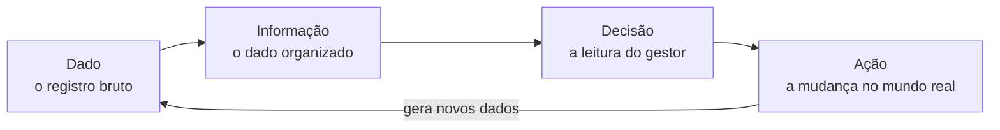
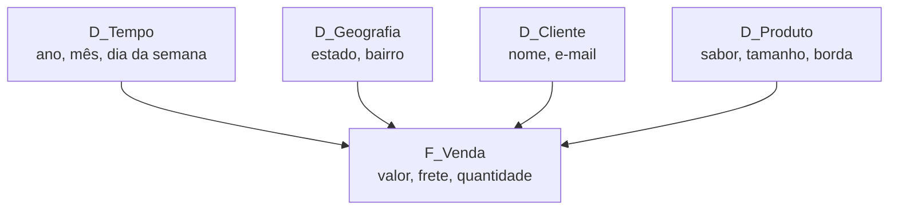
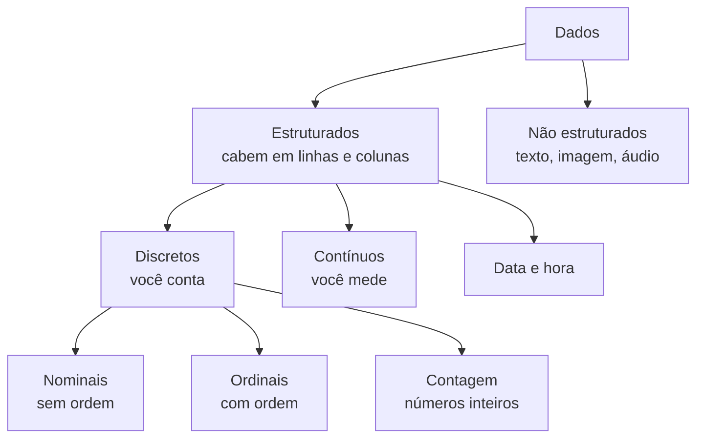
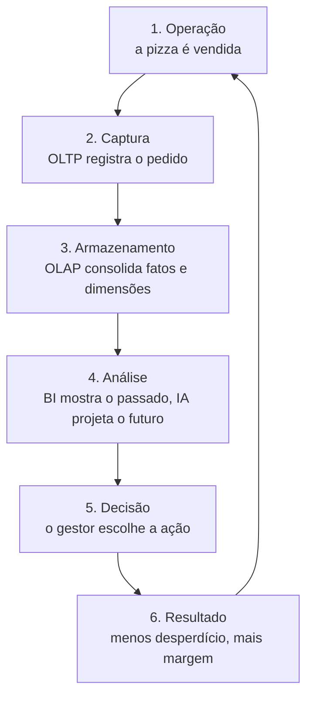

# Aula 2 — De Problemas de Negócio a Projetos de Dados

Vitto faz uma pizza excelente. A massa é fina, o forno é a lenha, os clientes são fiéis. Na cozinha ele é imbatível.

Quando as luzes se apagam, começa o problema. Sobra massa na terça e falta queijo no pico de sexta. No fim do mês, o lucro oscila sem explicação, mesmo com a casa cheia. Vitto sabe exatamente quanto tempo a pizza fica no forno, mas não sabe onde está perdendo dinheiro nas entregas.

Esta aula mostra o caminho que leva da queixa de Vitto até um projeto de dados que responde a ela. É um caminho com etapas claras, e cada uma tem nome.

## Problema de negócio ou problema de pesquisa

Nem toda pergunta merece um projeto. Antes de coletar qualquer dado, é preciso saber que tipo de pergunta você tem na mão.

Um **problema de pesquisa** nasce da curiosidade. Ele olha para o longo prazo e produz conhecimento. Se Vitto se pergunta "será que chove mais às sextas-feiras?", ele tem um problema de pesquisa. A resposta é interessante e não paga nenhuma conta.

Um **problema de negócio** nasce de uma dor. Ele tem prazo curto e mexe em faturamento, custo ou satisfação do cliente. Quando Vitto pergunta "por que minha margem nas entregas caiu 15% neste trimestre?", ele tem um problema de negócio.

A diferença prática é uma só: o problema de negócio tem dono, tem prazo e tem dinheiro em jogo.


Um teste rápido: pergunte "e se eu descobrir a resposta, o que muda amanhã?". Se a resposta for "nada, mas é curioso", você tem um problema de pesquisa. Se for "eu mudo o cardápio", você tem um problema de negócio.


## Traduzir a dor em um projeto de dados

Identificar a dor é o primeiro passo. O segundo é traduzi-la. Quem trabalha com dados atua como tradutor: pega uma queixa em linguagem de cozinha e devolve uma pergunta que um banco de dados consegue responder.

Vitto chega reclamando: *"por que estou perdendo dinheiro com a pizza de calabresa?"*. Essa frase não vira consulta. Falta escopo, falta método, falta período.

| Pergunta de negócio (a dor) | Tradução analítica (o projeto) |
| --- | --- |
| "Por que estou perdendo dinheiro com a pizza de calabresa?" | Análise histórica da correlação entre o custo dos fornecedores de embutidos e o ticket médio por pedido, entre 2025 e 2026 |

Repare no que a tradução acrescentou: o que medir (custo de fornecedor e ticket médio), como medir (correlação histórica) e em que período (2025–2026). Sem essas três coisas, o projeto não tem fim — sempre cabe mais uma consulta.

## Business Intelligence é um método, não um software

É comum confundir BI com um programa cheio de gráficos coloridos. BI é o caminho inteiro que leva de um fato bruto até uma ação que muda o resultado do mês.



Cada etapa tem um exemplo na pizzaria de Vitto:

* **Dado** — a comanda 104 comprou uma calabresa às 20h14 de terça.
* **Informação** — o relatório do mês, com as vendas agrupadas por dia e por sabor.
* **Decisão** — a leitura de que a promoção de terça vende volume, mas dá prejuízo.
* **Ação** — encerrar a promoção de terça e trocá-la por um combo com margem melhor.

A seta que volta é a parte que as pessoas esquecem. A ação nova gera vendas novas, que viram dados novos, que serão analisados no mês seguinte. BI não é um relatório: é um ciclo que não para.

## Duas cozinhas: OLTP e OLAP

Na cozinha da pizzaria, quem monta pizza no pico da noite não pode ser interrompido por alguém contando caixas de tomate do ano passado. São trabalhos diferentes, com ritmos diferentes, e precisam de bancadas separadas.

Com bancos de dados acontece a mesma coisa.

O **sistema transacional** (OLTP, de *Online Transaction Processing*) é o do dia a dia. Ele registra cada venda no instante em que ela acontece. Precisa ser rápido acima de tudo. Para não travar o caixa, dados antigos são arquivados ou apagados — por isso dizemos que os dados do OLTP são **voláteis**.

O **sistema analítico** (OLAP, de *Online Analytical Processing*) guarda o histórico. Ele acumula meses e anos de vendas, mantém tudo padronizado e serve para consultas pesadas. Ninguém digita pedido nele.

| Característica | OLTP | OLAP |
| --- | --- | --- |
| Para que serve | registrar a operação | analisar o histórico |
| Escrita | milhares de vezes por dia | uma carga por noite |
| Quantos dados | os recentes | todos |
| Consulta típica | "qual o pedido 104?" | "quanto vendemos de calabresa por bairro em 2025?" |

Se você rodar a segunda consulta no banco do caixa, em plena sexta às 20h, o atendimento para. Essa é a razão prática de separar os dois.


A carga do OLTP para o OLAP costuma acontecer de madrugada. Isso significa que o painel que você abre pela manhã mostra o mundo até ontem — é o que se chama latência D-1. Antes de discutir um número com alguém, confira até quando ele está atualizado.


## Fato e dimensão

O banco analítico chama-se **Data Warehouse** (armazém de dados). Ele organiza tudo em dois tipos de tabela.

O **fato** é o que se mede. São os números que você soma, conta ou tira média. A tabela de fatos responde a "o quê?" e "quanto?". Na pizzaria, a tabela `F_Venda` guarda o valor do pedido, o valor do frete, o imposto e a quantidade vendida.

Ao lado desses números, o fato guarda um código de ligação para cada dimensão: `Data`, `Id_Cliente`, `Id_Produto`, `Id_Funcionario`. São esses códigos — e nada mais — que amarram a estrutura inteira. Sem eles, a tabela de fatos é uma pilha de números sem contexto.

A **dimensão** é o contexto. É por onde você fatia os números. A tabela de dimensão responde a "quem?", "quando?", "onde?" e "qual?". Na pizzaria temos quatro:

* `D_Tempo` — ano, mês, dia da semana, feriado.
* `D_Geografia` — país, estado, bairro de entrega.
* `D_Cliente` — código, nome, e-mail.
* `D_Produto` — SKU (o código do produto), nome da pizza, tamanho, borda recheada. É a dimensão que mais muda com o tempo, porque o cardápio muda.

Uma regra simples para reconhecer uma dimensão na hora:

> "Cada 'por' que adicionamos à consulta é uma nova Dimensão. Quanto mais estratificarmos a informação, mais dimensões estamos adicionando à análise."
> — Ronaldo Braghittoni, *Business Intelligence: implementar do jeito certo e a custo zero*

Total de vendas **por** mês: uma dimensão. Total de vendas por mês **por** produto: duas. Por mês, por produto e **por** bairro: três.

A dimensão de tempo é obrigatória. Mesmo que o armazém não tenha nenhuma outra, precisa ter essa — sem data, nenhum número pode ser comparado com outro.

## O modelo estrela

Quando você desenha a tabela de fatos no centro e as dimensões ao redor, o resultado parece uma estrela. Daí o nome: **modelo estrela** (*star schema*).



O desenho é simples de propósito: quanto menos saltos entre tabelas, mais rápida a consulta. Com essa estrutura, uma pergunta como "quantas pizzas de borda recheada foram entregues no Centro nas noites de domingo do ano passado?" cruza quatro dimensões e volta em segundos.

## Os tipos de dado na despensa

Assim como o pizzaiolo distingue farinha, azeite e fermento, o analista precisa distinguir tipos de dado. Cada tipo aceita um tratamento diferente — e recusa os outros.



**Dados discretos** são contáveis ou categorizados, sem valores intermediários. Dividem-se em três:

* **Nominais** — rótulos sem ordem. Margherita, calabresa e quatro queijos são categorias diferentes; nenhuma é "maior" que a outra.
* **Ordinais** — categorias com ordem. Os tamanhos P, M, G e GG têm direção clara, mesmo que a distância entre P e M não seja medível em números. O mesmo vale para o grau de satisfação do cliente: baixa, média e alta.
* **Contagem** — inteiros que representam coisas indivisíveis. Doze entregadores na noite, três pizzas devolvidas. Não existem 2,5 entregadores.

**Dados contínuos** são medidas que aceitam frações. O peso exato da massa é 350,45 gramas. A temperatura do forno é 415,8 °C. Entre dois valores quaisquer sempre cabe outro.

**Data e hora** marcam o instante do evento: `2026-05-19 20:14:59`. É a âncora que permite ver sazonalidade — descobrir, por exemplo, que o pico de pedidos acontece às 20h, ou que os atrasos se concentram nos fins de semana chuvosos.

**Texto** é o comentário livre que o cliente deixa no aplicativo. Dois exemplos reais da pizzaria de Vitto:

```
"A pizza é uma obra-prima, a massa fininha e crocante, nota 10!"

"Atrasou 40 minutos e chegou completamente fria. Péssima experiência."
```

Ler dez comentários é fácil. Ler cinco mil, todo mês, não é. É aqui que o BI clássico chega ao limite e pede ajuda.

## Quando o BI encontra a Inteligência Artificial

O BI é o retrovisor: mostra com clareza o que aconteceu e por quê. Faltou queijo em dezembro, e a causa foi um pedido de compra atrasado.

A IA é o binóculo apontado para a frente. Ela responde "o que vai acontecer?" e "o que fazer agora?". Na pizzaria de Vitto, isso aparece de três formas.

**Previsão de demanda** (*forecasting*). O modelo cruza o histórico de vendas com a previsão do tempo e estima quantos quilos de massa preparar para a próxima sexta chuvosa. O desperdício de terça cai.

**Processamento de linguagem natural** (NLP). O modelo lê os cinco mil comentários, classifica cada um como elogio ou reclamação e agrupa os assuntos. Resultado: "pizza chegou fria" é o motivo número um pelo qual os clientes do bairro vizinho pararam de comprar.

**Próxima melhor ação** (*next best action*). Em vez de dar desconto para todo mundo, o sistema identifica quem tem alta chance de abandonar o carrinho e oferece um refrigerante grátis só para essas pessoas, em tempo real.

Repare que os três casos partem do mesmo lugar: dados que já existiam e ninguém lia.

## O ciclo completo

Tudo o que vimos nesta aula se encaixa em um circuito. Ele começa e termina na operação.



A essência do negócio não muda. Vitto continua fazendo pizza boa com ingrediente bom. O que muda é que as decisões de fora da cozinha param de depender de intuição.

Na próxima aula vamos entrar na primeira análise de verdade: pegar as colunas discretas de uma planilha de vendas real e transformá-las em respostas.

## Bibliografia

Braghittoni, R. (2017). *Business Intelligence: implementar do jeito certo e a custo zero*. Casa do Código.

Sharda, R., Delen, D., & Turban, E. (2024). *Business intelligence, analytics, data science, and AI: A managerial perspective* (5th ed.). Pearson.

Zwingmann, T. (2022). *AI-powered business intelligence*. O'Reilly Media.

> **Nota sobre o uso de IA:** este material foi produzido com apoio de inteligência artificial (Claude), a partir dos livros listados na bibliografia e dos dados fornecidos pelo professor.
>
