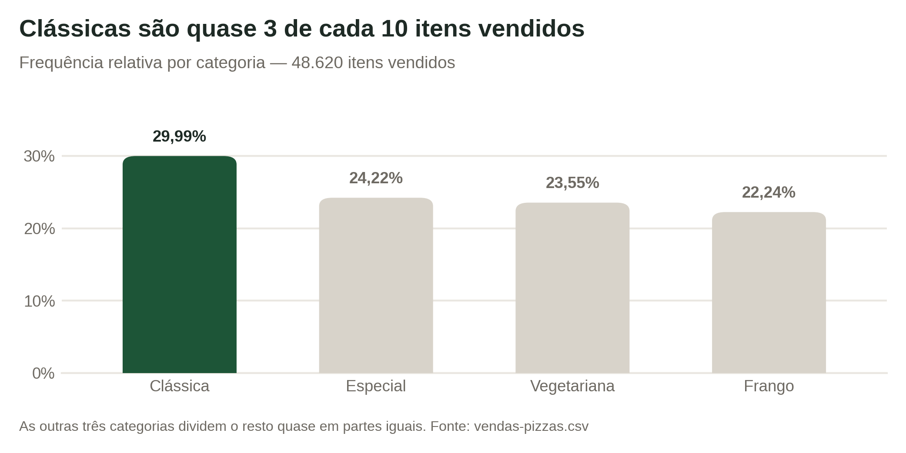
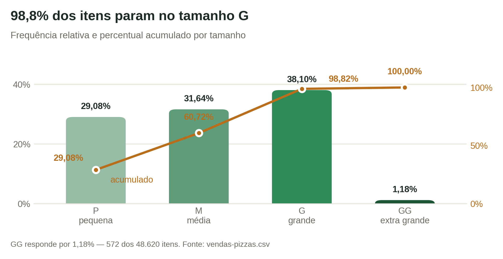
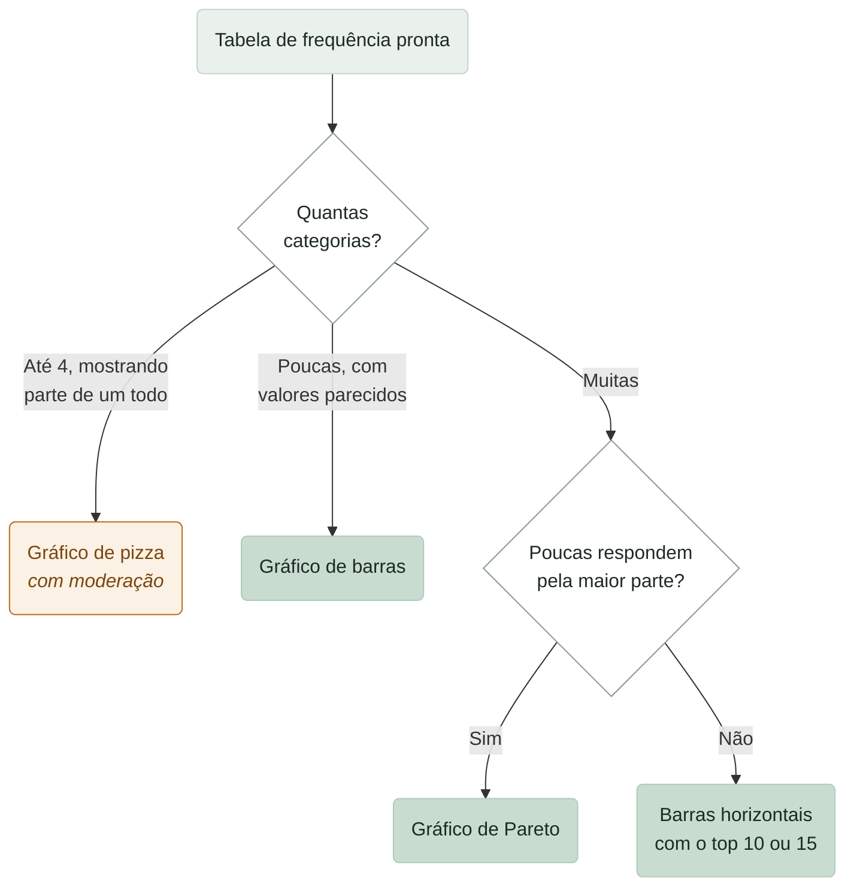
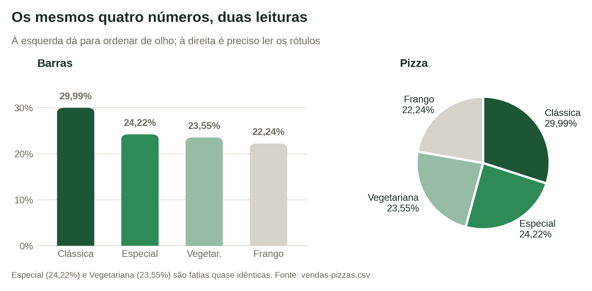
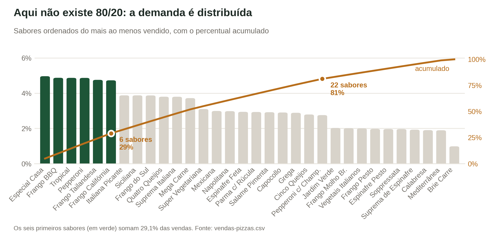

# Aula 3 — Análise de Dados Discretos

No fim do mês, alguém pergunta ao dono da pizzaria: *"qual sabor vendeu mais? qual tamanho o pessoal mais pediu?"*. A resposta não pode ser um palpite.

Vamos usar uma [planilha real de vendas de pizza](https://docs.google.com/spreadsheets/d/1blCNnBRkUsfui_Dfxx5otrY95CObraKghRKDCV7scSE/edit?usp=sharing) para responder. Ela tem 48.620 linhas — cada linha é um item vendido, com sabor, tamanho, categoria, horário e valor.

A ferramenta desta aula chama-se **análise de frequência**. Você provavelmente já usou sem saber o nome.

## Contar ou medir

Antes de contar qualquer coisa, é preciso saber o que você está contando. As colunas da planilha se dividem em dois grupos.

**Dados contínuos** são os que você mede e usa em contas. `preco_total` é um deles: faz sentido somar, tirar média, calcular o faturamento do mês.

**Dados discretos** são os que classificam. `sabor_pizza`, `tamanho` e `categoria` colocam cada venda em uma caixinha. Uma pizza é "Frango" ou "Vegetariana"; é "P", "M", "G" ou "GG". Não existe meia categoria.

Dentro dos discretos há uma distinção que muda a análise:

* **Ordinais** têm ordem natural. P, M, G e GG vão do menor para o maior. Faz sentido perguntar "quantos pedidos ficam até o tamanho G?".
* **Nominais** não têm ordem. "Clássica" não é maior nem menor que "Frango". Perguntar "quantos ficam até a categoria Especial?" não significa nada.

Por que isso importa? Porque a média dos sabores não existe. Não dá para somar "Frango" com "Vegetariana" e dividir por dois. Como resume o livro-texto do curso:

> "Mesmo quando os valores usados para as variáveis categóricas são numéricos, esses números não passam de símbolos e não implicam a possibilidade de calcular valores fracionários."
> — Ramesh Sharda, Dursun Delen e Efraim Turban, *Business Intelligence, Analytics, Data Science, and AI*

Com dados discretos, a pergunta certa é outra: **quantas vezes cada categoria aparece?**

## Frequência absoluta: contar

A **frequência absoluta** é a contagem bruta: quantas vezes cada categoria apareceu. Sem porcentagem, sem fórmula.

A coluna `categoria` separa as pizzas em quatro grupos:

| Categoria | Frequência absoluta |
| --- | --- |
| Clássica | 14.579 |
| Especial | 11.777 |
| Vegetariana | 11.449 |
| Frango | 10.815 |
| **Total** | **48.620** |

Some as quatro frequências: o resultado bate com o total de linhas da planilha. Essa é a primeira conferência que você deve fazer sempre. Se não bater, alguma linha ficou de fora ou foi contada duas vezes.

No Google Planilhas, essa contagem sai com `=CONT.SE()` para uma categoria por vez, ou com uma **tabela dinâmica** para todas de uma vez.


Cuidado com o que você está contando. A planilha tem 48.620 **linhas**, mas apenas 21.350 **pedidos** — um pedido pode ter várias pizzas. E como a coluna `quantidade` às vezes é maior que 1, o total de **pizzas** vendidas é 49.574.

São três números diferentes para a mesma planilha. Antes de publicar qualquer percentual, diga em voz alta qual deles está no denominador. Nesta aula, contamos linhas: cada linha é um item vendido.


## Frequência relativa: comparar

A contagem sozinha não diz se um número é grande. "Vendemos 14.579 clássicas" é muito ou pouco? Depende do total.

A **frequência relativa** divide a frequência absoluta pelo total e transforma em porcentagem:

$$
f_r = \frac{f_i}{n} \times 100
$$

Aqui, $$f_i$$ é a frequência absoluta da categoria, $$n$$ é o total de observações e $$f_r$$ é o resultado, em porcentagem.

Exemplo com a categoria Clássica: $$f_i = 14\,579$$ e $$n = 48\,620$$. A conta fica $$14\,579 \div 48\,620 = 0{,}2999$$, que multiplicado por 100 dá **29,99%**.

Aplicando a todas as categorias:

| Categoria | Frequência absoluta | Frequência relativa |
| --- | --- | --- |
| Clássica | 14.579 | 29,99% |
| Especial | 11.777 | 24,22% |
| Vegetariana | 11.449 | 23,55% |
| Frango | 10.815 | 22,24% |
| **Total** | **48.620** | **100%** |

Agora a história fica clara: quase 3 em cada 10 itens vendidos são Clássicos, e as outras três categorias dividem o resto quase em partes iguais.

A soma das frequências relativas de uma variável tem que dar 100%. Se der 99,7% ou 100,4%, é arredondamento. Se der 87%, é erro.

## Frequência relativa é probabilidade

A frequência relativa também estima uma **probabilidade empírica** — a chance de um evento acontecer, calculada a partir do que já foi observado:

$$
P = \frac{\text{número de ocorrências}}{\text{total de observações}}
$$

Aqui, $$P$$ é a probabilidade estimada, entre 0 e 1.

Exemplo: se você sortear uma linha qualquer da planilha, qual a chance de ela ser uma pizza Clássica? A conta é $$14\,579 \div 48\,620 = 0{,}2999$$. Ou seja, cerca de 30%.

Essa probabilidade descreve o passado. Ela não garante o próximo pedido. Quanto mais dados representativos você tiver, melhor a frequência relativa estima a probabilidade real.

## Frequência cumulativa: somar em ordem

A **frequência cumulativa** mostra quanto já foi acumulado até cada categoria. Ela só funciona com dados ordinais — tamanhos, faixas etárias, níveis de satisfação. Não use com sabores.

Para calcular, some a frequência da categoria atual às anteriores. A versão relativa faz o mesmo com as porcentagens.

| Tamanho | Frequência absoluta | Frequência relativa | Frequência cumulativa | Percentual cumulativo |
| --- | --- | --- | --- | --- |
| P (pequena) | 14.137 | 29,08% | 14.137 | 29,08% |
| M (média) | 15.385 | 31,64% | 29.522 | 60,72% |
| G (grande) | 18.526 | 38,10% | 48.048 | 98,82% |
| GG (extra grande) | 572 | 1,18% | 48.620 | 100,00% |

Três leituras saem daqui. 60,72% dos itens são P ou M. 98,82% não passam de G. E o GG responde por 1,18% das vendas — 572 itens em vinte meses.

Esse 1,18% é uma decisão de cardápio à espera do dono. E o número fica mais interessante quando você olha um degrau abaixo: todas as 572 pizzas GG são do mesmo sabor — a Grega é a única do cardápio que existe em tamanho extra grande. Não é um tamanho pouco pedido; é um tamanho que atende a uma pizza só.

## Do número para a imagem

Tabelas servem para conferir valores com precisão. Mas o olho humano compara barras melhor do que compara números em uma lista. Por isso quase toda tabela de frequência vira gráfico.

O **gráfico de barras** é o canivete suíço dos dados discretos. Cada categoria vira uma barra e a altura representa a frequência. Funciona com qualquer quantidade de categorias.

O **gráfico de pizza** é o mais traiçoeiro. Ele só funciona com poucas categorias e quando a ideia de "parte de um todo" importa. Com valores parecidos, ele falha:

Olhe os dois gráficos e responda de cabeça: quem vende mais, Especial ou Vegetariana? Nas barras a resposta é imediata. Na pizza, as fatias de 24,22% e 23,55% são indistinguíveis e você é obrigado a ler os rótulos. Esse é o teste: se o leitor precisa dos números para enxergar a ordem, o gráfico não fez o trabalho dele.

A recomendação do livro-texto é direta:

> "Gráficos de pizza só devem ser usados para ilustrar proporções relativas de uma medida específica. Se o número de categorias for mais do que umas poucas — digamos, mais de quatro —, você deveria considerar seriamente usar um gráfico de barras."
> — Ramesh Sharda, Dursun Delen e Efraim Turban, *Business Intelligence, Analytics, Data Science, and AI*

## Pareto: quais poucos respondem pela maior parte

O **gráfico de Pareto** é um gráfico de barras ordenado da categoria mais frequente para a menos frequente, com a linha de percentual acumulado por cima. Ele serve para responder a uma pergunta só: quais poucas categorias respondem pela maior parte do total?

Você deve estar se perguntando como o acumulado pode aparecer aqui, se a regra dizia que ele só vale para dados ordinais. O Pareto contorna a regra criando uma ordem própria: não a ordem natural da categoria — sabor não tem —, mas a ordem da frequência. É essa ordenação artificial que dá sentido à linha.

A planilha tem 32 sabores distintos na coluna `nome_pizza`. Ordenando todos e acumulando:

A resposta, neste caso, é surpreendente: **não existe 80/20 aqui**. Os 6 sabores mais vendidos somam 29,1% das vendas. Para passar dos 80%, você precisa de 22 dos 32 sabores. A linha acumulada sobe quase reta, sem o "cotovelo" típico de uma distribuição concentrada.

Isso é uma descoberta de negócio, não uma falha do gráfico. Numa loja onde poucos produtos dominam, cortar a cauda é fácil. Nesta pizzaria, quase todo sabor tem público — e enxugar o cardápio vai custar vendas.


A coluna `sabor_pizza` tem 90 valores distintos, e não 32. O motivo é que ela junta sabor e tamanho no mesmo código: `tropical_p`, `tropical_m` e `tropical_g` são três códigos para o mesmo sabor.

Contar categorias sem olhar como a coluna foi montada é uma das formas mais comuns de errar um relatório. Abra sempre a lista de valores únicos antes de contar.


## Quanto confiar em um percentual

Os percentuais desta aula descrevem os 48.620 itens da planilha. Para esse conjunto, eles não têm erro: foram contados um a um.

A conversa muda quando os dados são uma **amostra** e você quer falar sobre o futuro ou sobre um universo maior. Aí entra a **margem de erro**, que indica a faixa plausível para o percentual real:

$$
ME = 1{,}96 \times \sqrt{\frac{p \times (1-p)}{n}}
$$

Aqui, $$p$$ é a frequência relativa em proporção (30% vira 0,30), $$n$$ é o tamanho da amostra e $$1{,}96$$ é o valor que corresponde a 95% de confiança. O resultado sai em proporção; multiplique por 100 para ter pontos percentuais.

Exemplo: você pesquisou uma amostra de 1.000 pedidos e encontrou 30% de pizzas Clássicas. A conta é $$0{,}30 \times 0{,}70 = 0{,}21$$; dividido por 1.000 dá $$0{,}00021$$; a raiz quadrada é $$0{,}0145$$; multiplicado por 1,96 dá $$0{,}0284$$. A margem é de **±2,84 pontos percentuais**, e a faixa plausível vai de 27,16% a 32,84%.

Repare no efeito de $$n$$: quadruplicar a amostra corta a margem pela metade. É por isso que pesquisas pequenas produzem faixas largas.

## Contar uma história com os números

Um gráfico bonito não é o objetivo. Ele é o meio de comunicar uma mensagem.

Dois analistas podem olhar a mesma tabela e produzir coisas diferentes: um gráfico genérico que ninguém lembra, ou um gráfico que faz a mensagem chegar em três segundos. A diferença está em três perguntas feitas **antes** de abrir a planilha.

**Qual é o ponto principal?** Se você só pudesse dizer uma frase, qual seria? "O tamanho G domina as vendas" é uma frase. "Aqui está a distribuição de tamanhos" não é.

**Quem é o público?** Um gráfico para o dono decidir o cardápio é diferente de um gráfico para uma aula de estatística. O primeiro precisa apontar uma decisão; o segundo precisa mostrar o método.

**O que a pessoa deve fazer com isso?** Toda boa história de dados aponta para algum lugar — uma decisão, uma pergunta seguinte, uma ação.

## Seis princípios de visualização

Junto com a história, alguns princípios separam um gráfico eficiente de um confuso.

**Simplicidade primeiro.** Corte bordas, efeitos 3D, grades densas e legendas redundantes. Se um elemento não ajuda a entender, ele atrapalha.

**O gráfico certo para o dado certo.** Dados categóricos pedem barras, pizza com moderação ou Pareto. Linha é para tempo; dispersão é para relação entre duas variáveis numéricas.

**Ordene com intenção.** Barras ordenadas da maior para a menor são quase sempre mais fáceis de ler — a menos que a ordem natural (P, M, G, GG) seja o que importa.

**Cor com propósito.** Use cor para destacar o que importa: a categoria principal em cor forte, o resto em cinza. No primeiro gráfico desta aula, só a barra Clássica é verde. As outras três estão em cinza porque a mensagem é sobre a Clássica.

**Título e rótulo fazem o trabalho pesado.** "Distribuição de categorias de pizza" é um título neutro. "Clássicas são quase 3 de cada 10 pizzas vendidas" entrega a mensagem antes de o leitor olhar as barras.

**Cuidado com o eixo.** Cortar o eixo vertical de um gráfico de barras — começar em 20% em vez de zero — exagera as diferenças e engana quem lê, mesmo sem intenção.

Com isso na cabeça, o próximo passo é prático: montar tabelas dinâmicas e gráficos de frequência no Google Planilhas a partir do arquivo `vendas-pizzas.csv`, e depois um painel no Looker Studio que conte uma história com esses dados.

## Bibliografia

Sharda, R., Delen, D., & Turban, E. (2024). *Business intelligence, analytics, data science, and AI: A managerial perspective* (5th ed.). Pearson.

> **Nota sobre o uso de IA:** este material foi produzido com apoio de inteligência artificial (Claude), a partir dos livros listados na bibliografia e dos dados fornecidos pelo professor.
>
