# Aula 4 — Análise de Dados Contínuos

Uma pizzaria vendeu 49.574 pizzas entre janeiro de 2025 e agosto de 2026. São 21.350 pedidos, 32 sabores e quatro tamanhos. Cada linha da planilha guarda o sabor, o horário, o tamanho e o valor.

Algumas dessas colunas você conta. Outras você mede. Essa diferença muda tudo o que vem depois.

## Contar ou medir

A coluna `nome_pizza` você conta. Existem 32 sabores, e cada pizza vendida cai em um deles. Para resumir essa coluna basta uma tabela: a Especial da Casa saiu 2.416 vezes, a Frango com Barbecue 2.372, e assim por diante. Dados assim são **categóricos**.

A coluna `preco_total` você mede. Um pedido pode custar R\$ 48,75, R\$ 103,75 ou R\$ 2.221,00. Entre dois valores quaisquer sempre cabe outro. Dados assim são **contínuos**.

Em Business Intelligence, essa coluna medida tem nome próprio:

> "O fato: fato, ou medida (*measure*), é toda informação que será matematicamente analisada. São as quantidades, valores, médias etc."
> — Ronaldo Braghittoni, *Business Intelligence: implementar do jeito certo e a custo zero*

O valor do pedido é o fato desta aula. É sobre ele que faremos todas as contas.


Um teste rápido: se somar dois valores da coluna produzir algo com sentido, ela é contínua. Somar R\$ 60,00 com R\$ 80,00 dá R\$ 140,00 — faz sentido. Somar "Calabresa" com "Portuguesa" não dá nada.


## Por que a tabela de frequências quebra

Com dados categóricos, você conta quantas vezes cada valor aparece. Isso se chama **frequência**.

Tente o mesmo com o valor dos pedidos. Os 21.350 pedidos têm 1.113 valores diferentes. Uma tabela de frequências teria 1.113 linhas, quase todas com contagem baixa. Ninguém lê isso.

A saída é parar de contar valores e passar a contar **faixas**. Em vez de perguntar "quantos pedidos custaram exatamente R\$ 103,75?", pergunte "quantos pedidos custaram entre R\$ 100,00 e R\$ 150,00?".

```mermaid
%%{init:{"theme":"base","themeVariables":{"fontFamily":"Inter,'Segoe UI','Liberation Sans',Helvetica,Arial,sans-serif","fontSize":"15px","primaryColor":"#F4F2EE","primaryTextColor":"#1E2A25","primaryBorderColor":"#CBD8D0","lineColor":"#8A9A90","secondaryColor":"#EDF2EE","tertiaryColor":"#FFFFFF","clusterBkg":"#F8F7F4","clusterBorder":"#E2DED7","edgeLabelBackground":"#FFFFFF"},"flowchart":{"nodeSpacing":28,"rankSpacing":38,"padding":14,"curve":"basis"}}}%%
flowchart LR
    A("21.350 valores de pedido<br/>1.113 valores diferentes") --> B("Escolher a largura<br/>da faixa: R$ 50")
    B --> C("Contar quantos pedidos<br/>caem em cada faixa")
    C --> D("Desenhar uma barra<br/>por faixa")
    D --> E("<b>Histograma</b>")
    classDef destaque fill:#1D5537,stroke:#1D5537,color:#FFFFFF;
    classDef neutro fill:#F4F2EE,stroke:#DCD8D1,color:#1E2A25;
    classDef nevoa fill:#EAF1EC,stroke:#C3D6CA,color:#1E2A25;
    class A nevoa
    class B,C,D neutro
    class E destaque
```

Cada faixa é uma **classe** (ou *bin*). O gráfico de barras dessas contagens é o **histograma**.

Veja o resultado com faixas de R\$ 50:

| Faixa de valor do pedido | Pedidos | % do total |
| --- | --- | --- |
| menos de R\$ 50 | 105 | 0,5% |
| R\$ 50 a R\$ 100 | 5.527 | 25,9% |
| R\$ 100 a R\$ 150 | 4.336 | 20,3% |
| R\$ 150 a R\$ 200 | 3.825 | 17,9% |
| R\$ 200 a R\$ 250 | 2.307 | 10,8% |
| R\$ 250 a R\$ 300 | 1.861 | 8,7% |
| R\$ 300 a R\$ 350 | 1.701 | 8,0% |
| R\$ 350 a R\$ 400 | 903 | 4,2% |
| R\$ 400 a R\$ 450 | 150 | 0,7% |
| R\$ 450 a R\$ 500 | 66 | 0,3% |
| R\$ 500 ou mais | 569 | 2,7% |
| **Total** | **21.350** | **100%** |

Onze linhas em vez de 1.113. Desenhando uma barra por faixa, a forma dos dados aparece de uma vez:

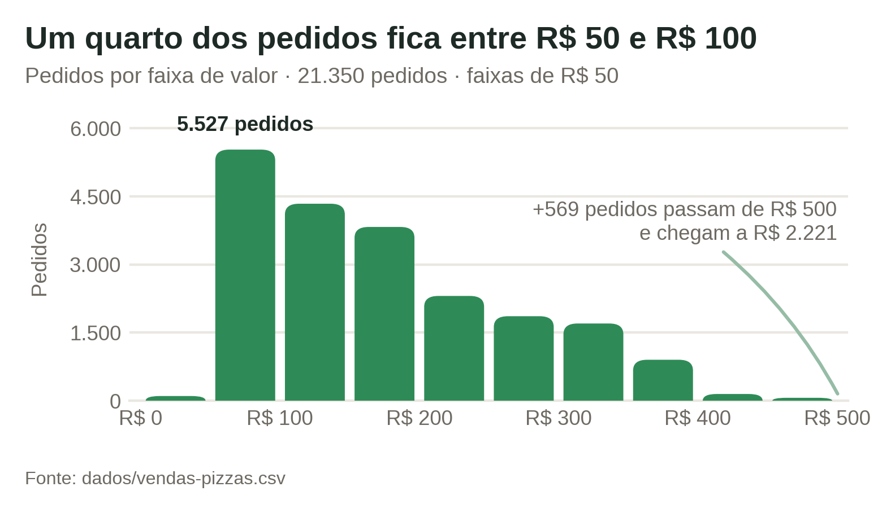

A barra mais alta é a de R\$ 50 a R\$ 100. Da esquerda para a direita, as barras encolhem: quanto mais caro o pedido, menos vezes ele acontece.

A escolha de R\$ 50 não é neutra. Os mesmos dados, contados em faixas maiores ou menores, contam histórias diferentes:

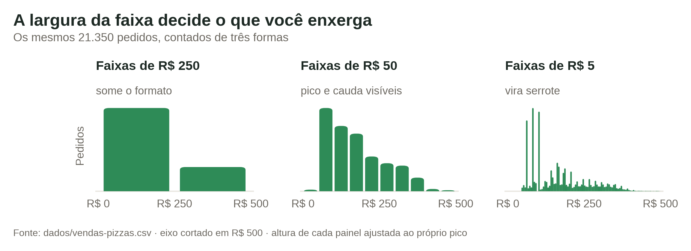


A largura da faixa muda o desenho. Faixas largas demais escondem detalhes: com uma faixa única de R\$ 0 a R\$ 500 você veria uma barra só. Faixas estreitas demais devolvem o problema original: com faixas de R\$ 1, a maioria ficaria vazia. Comece com 10 a 20 faixas e ajuste olhando o gráfico.


## O histograma é uma distribuição de probabilidade

A coluna "% do total" da tabela acima faz mais do que resumir. Ela estima probabilidades.

Escolha um desses 21.350 pedidos ao acaso. Qual a chance de ele ter custado entre R\$ 50,00 e R\$ 100,00? A faixa concentra 25,9% dos pedidos, então a chance é de cerca de 26% — pouco mais de um em cada quatro.

Isso vale para qualquer região do gráfico. Some as faixas que interessam e você tem a probabilidade daquele intervalo. Somando tudo abaixo de R\$ 200,00:

0,5% + 25,9% + 20,3% + 17,9% = 64,6%

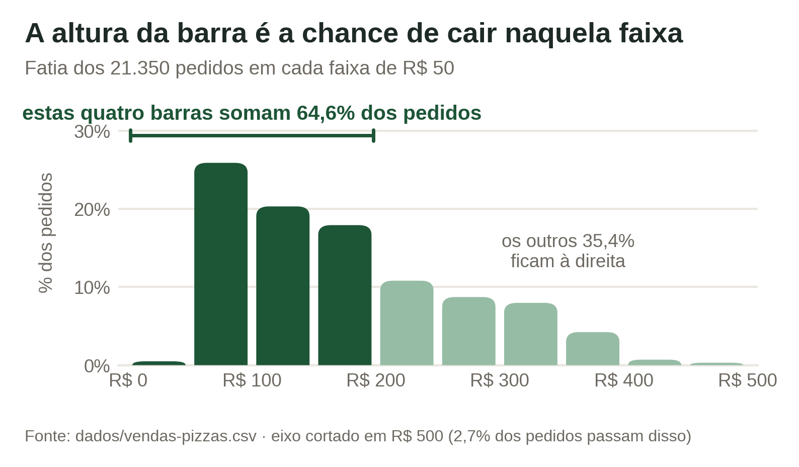

Quase dois terços dos pedidos ficam abaixo de R\$ 200,00. Se a pizzaria criar um cupom válido só para pedidos acima desse valor, ele atinge cerca de 35% dos pedidos.

Barra alta significa região onde os dados se acumulam. É o que chamamos de **densidade**: quanto mais alta a barra, mais provável cair ali. Barra baixa significa região rarefeita. As barras de R\$ 400 a R\$ 500 somam apenas 1% — pedidos desse tamanho existem, mas são raros.

E a soma de todas as barras é sempre 100%. O histograma inteiro cobre todos os casos possíveis.


Essa é a leitura mais útil do histograma no dia a dia: ele responde "qual a chance de acontecer X?" sem exigir nenhuma fórmula de probabilidade. Basta olhar a área das barras.


## Quatro coisas que o histograma revela

Olhar um histograma é ler quatro características ao mesmo tempo.

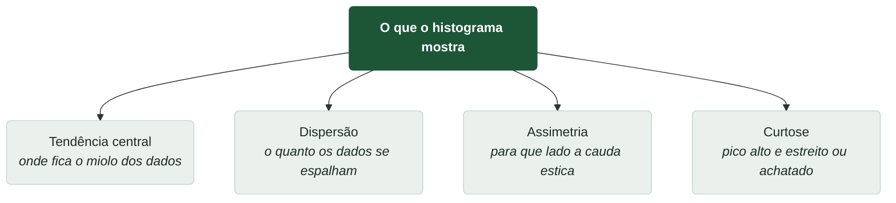

**Tendência central** é a posição do bloco principal. No histograma dos pedidos, o miolo está entre R\$ 50 e R\$ 200.

**Dispersão** é a largura do bloco. Os pedidos vão de R\$ 48,75 a R\$ 2.221,00: um espalhamento enorme.

**Assimetria** e **curtose** merecem cada uma sua seção, logo abaixo.

## Assimetria: para que lado a cauda estica

Uma distribuição **simétrica** tem os dois lados parecidos. Dobrada ao meio, uma metade cobre a outra.

O histograma dos pedidos não é assim. Ele tem um pico à esquerda, perto de R\$ 75, e uma cauda longa esticando para a direita, até passar de R\$ 2.000. Isso é **assimetria à direita** (ou assimetria positiva).

Existe um jeito de detectar isso sem olhar o gráfico: comparar média e mediana.

- Média dos 21.350 pedidos: R\$ 191,54
- Mediana dos 21.350 pedidos: R\$ 162,50

A média está R\$ 29,04 acima da mediana. Os pedidos gigantes puxam a média para cima, mas não mexem na mediana. Sempre que a média fica bem acima da mediana, a cauda estica para a direita.

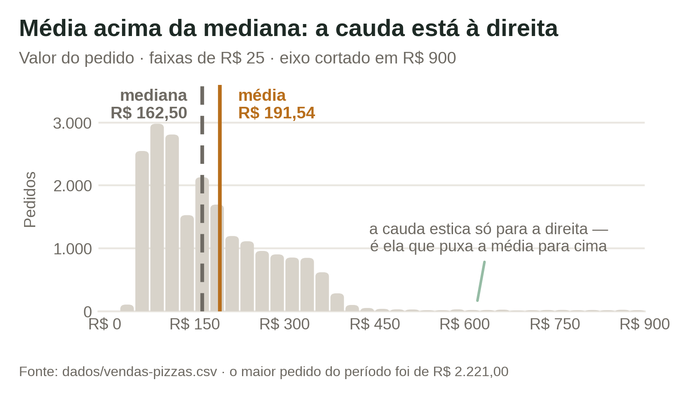

O contrário também vale. Se a média ficasse abaixo da mediana, a cauda esticaria para a esquerda — assimetria negativa. É o que aconteceria com notas de uma prova fácil, onde quase todo mundo tira nota alta e uns poucos tiram nota baixa.


Dados de dinheiro quase sempre têm assimetria à direita. Existe um piso natural (ninguém gasta menos que zero) mas não existe teto. Salários, faturamento, valor de imóveis e tempo de atendimento seguem o mesmo padrão.


## Curtose: pico alto ou achatado

**Curtose** descreve o formato do pico. Uma distribuição com curtose alta tem pico estreito e alto, com a maioria dos valores concentrada num pedaço pequeno — e, ao mesmo tempo, caudas mais longas, com valores extremos aparecendo mais do que o esperado. Curtose baixa é o oposto: pico achatado, valores repartidos de forma mais parelha.

Compare duas colunas da mesma planilha, desenhadas na mesma escala vertical:

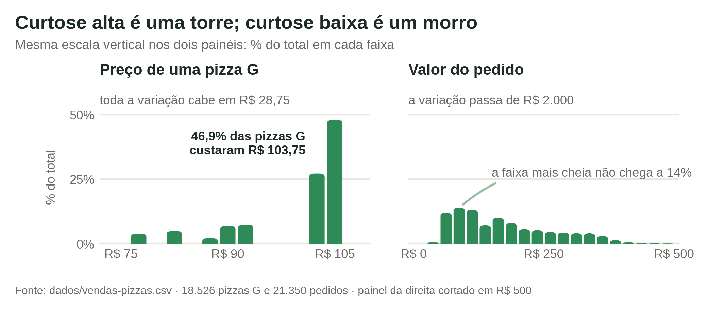

O **preço unitário das pizzas grandes** tem pico altíssimo. Das 18.526 pizzas grandes vendidas, metade custou entre R\$ 101,25 e R\$ 103,75. Quase tudo empilhado num intervalo de R\$ 2,50. O histograma é uma torre fina.

O **valor do pedido** tem pico bem mais baixo. Com faixas de R\$ 25, nem a faixa mais cheia chega a 14% dos pedidos: o total se reparte entre dezenas de faixas. O histograma é um morro largo com uma cauda comprida.

Na prática, curtose alta significa que a média representa bem os dados: quase todo mundo está perto dela. Curtose baixa significa o contrário.

## O conjunto de trabalho desta aula

Daqui em diante, todas as contas usam os nove primeiros pedidos do dia 26/09/2025 (pedidos 10101 a 10109). Com nove valores dá para conferir tudo no papel.

Já ordenados do menor para o maior:

| Posição | 1º | 2º | 3º | 4º | 5º | 6º | 7º | 8º | 9º |
| --- | --- | --- | --- | --- | --- | --- | --- | --- | --- |
| Valor (R\$) | 60,00 | 62,50 | 83,75 | 102,50 | 103,75 | 103,75 | 146,25 | 155,00 | 330,00 |

Ordenar é sempre o primeiro passo. Metade das medidas desta aula depende da ordem.

## Média

A média é a soma de todos os valores dividida pela quantidade de valores:

$$
\bar{x} = \frac{1}{n}\sum_{i=1}^{n}x_i
$$

Aqui, $$x_i$$ é cada valor da lista, $$n$$ é quantos valores existem, e $$\bar{x}$$ (lido "x-barra") é o resultado: a média.

Exemplo com os nove pedidos. Soma:

60,00 + 62,50 + 83,75 + 102,50 + 103,75 + 103,75 + 146,25 + 155,00 + 330,00 = 1.147,50

Divisão pela quantidade:

$$
\bar{x} = \frac{1147{,}50}{9} = 127{,}50
$$

O ticket médio daquele começo de noite foi de R\$ 127,50.

Repare num detalhe incômodo: seis dos nove pedidos custaram menos que a média. A média não é o valor do meio.

## Mediana

A mediana é o valor que fica no meio da lista ordenada. Metade dos valores está abaixo dela, metade acima.

Com nove valores, o meio é a 5ª posição:

60,00 · 62,50 · 83,75 · 102,50 · **103,75** · 103,75 · 146,25 · 155,00 · 330,00

A mediana é R\$ 103,75.

Quando a quantidade de valores é par, não existe uma posição central. Aí você tira a média dos dois valores do meio. Se descartássemos o pedido de R\$ 330,00, sobrariam oito valores, e o meio seria entre a 4ª e a 5ª posição:

$$
\text{mediana} = \frac{102{,}50 + 103{,}75}{2} = 103{,}125 \approx 103{,}13
$$

## Moda

A moda é o valor que mais se repete. Na lista dos nove pedidos, R\$ 103,75 aparece duas vezes e todos os outros aparecem uma vez só. A moda é R\$ 103,75.

A moda funciona bem quando existem poucos valores distintos. Nos 21.350 pedidos completos, a moda também é R\$ 103,75, que apareceu 1.444 vezes. Não é coincidência: R\$ 103,75 é o preço de uma pizza grande, e 1.443 desses pedidos eram exatamente isso — uma pizza G e nada mais. O pedido mais comum da casa.

Mas cuidado: se cada valor aparecesse uma vez só, não haveria moda nenhuma. Com dados contínuos de verdade, como tempo de entrega em segundos, isso costuma acontecer.

## Escolhendo entre média, mediana e moda

As três medidas respondem "onde fica o centro?", e dão respostas diferentes:

| Medida | Valor | Sofre com valores extremos? |
| --- | --- | --- |
| Média | R\$ 127,50 | Sim |
| Mediana | R\$ 103,75 | Não |
| Moda | R\$ 103,75 | Não |

Teste o efeito do pedido de R\$ 330,00. Retire-o e recalcule com os oito pedidos restantes:

- Nova média: 817,50 ÷ 8 = R\$ 102,19 — caiu R\$ 25,31
- Nova mediana: R\$ 103,13 — caiu R\$ 0,62

Um único pedido mexeu R\$ 25,31 na média e quase nada na mediana. É por isso que a mediana é a medida preferida quando existem valores extremos.

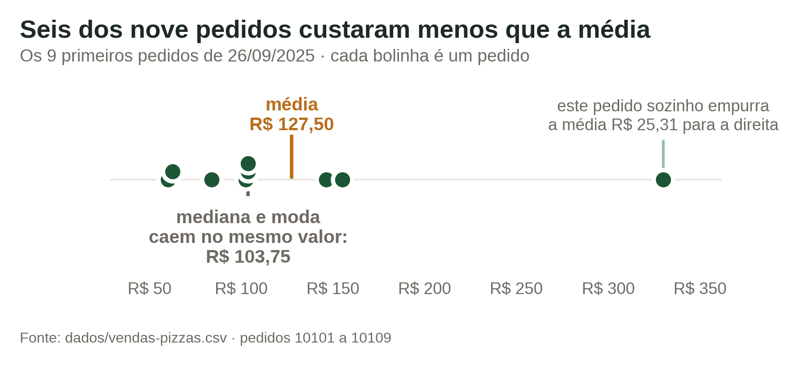

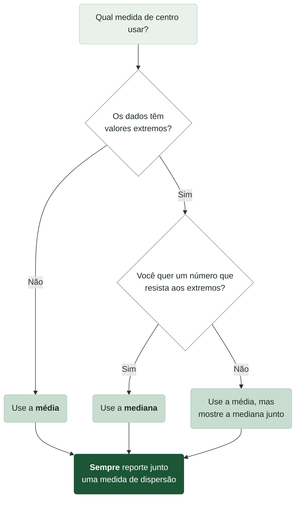

Nenhuma das três sozinha conta a história inteira:

> "É melhor apresentar a estatística descritiva como um pacote — uma combinação de medidas de centralidade e de dispersão — do que uma medida única como a média."
> — Ramesh Sharda, Dursun Delen e Efraim Turban, *Business Intelligence, Analytics, Data Science, and AI*

## Amplitude: o mínimo e o máximo

A **amplitude** é a distância entre o maior e o menor valor:

$$
\text{amplitude} = \text{máximo} - \text{mínimo}
$$

Nos nove pedidos: 330,00 − 60,00 = R\$ 270,00.

É a medida de dispersão mais fácil de calcular e a mais frágil. Ela usa apenas dois valores e ignora os outros sete. Nos 21.350 pedidos completos, a amplitude é 2.221,00 − 48,75 = R\$ 2.172,25 — um número que descreve só o pedido gigante de uma festa, não a rotina da pizzaria.

Use a amplitude para uma checagem rápida de sanidade dos dados. Se o mínimo de um preço vier negativo, você achou um erro de digitação.

## Variância e desvio-padrão

A ideia aqui é medir a distância média de cada pedido até a média. Se todos os pedidos estiverem perto de R\$ 127,50, a dispersão é pequena.

O problema é que as distâncias se cancelam: umas são negativas, outras positivas, e a soma dá zero. A solução é elevar cada distância ao quadrado antes de somar. Isso é a **variância**:

$$
s^2 = \frac{\sum_{i=1}^{n}(x_i - \bar{x})^2}{n-1}
$$

Aqui, $$x_i$$ é cada valor, $$\bar{x}$$ é a média, $$n$$ é a quantidade de valores, e $$s^2$$ é a variância.

Exemplo com os nove pedidos, média R\$ 127,50:

| Valor | Distância até a média | Distância ao quadrado |
| --- | --- | --- |
| 60,00 | −67,50 | 4.556,25 |
| 62,50 | −65,00 | 4.225,00 |
| 83,75 | −43,75 | 1.914,0625 |
| 102,50 | −25,00 | 625,00 |
| 103,75 | −23,75 | 564,0625 |
| 103,75 | −23,75 | 564,0625 |
| 146,25 | +18,75 | 351,5625 |
| 155,00 | +27,50 | 756,25 |
| 330,00 | +202,50 | 41.006,25 |
| | **Soma** | **54.562,50** |

$$
s^2 = \frac{54562{,}50}{9-1} = \frac{54562{,}50}{8} = 6820{,}31
$$

O resultado é 6.820,31 reais **ao quadrado**. Reais ao quadrado não existem. Por isso tiramos a raiz quadrada e voltamos para a unidade original. Isso é o **desvio-padrão**:

$$
s = \sqrt{s^2} = \sqrt{6820{,}31} = 82{,}59
$$

O desvio-padrão é R\$ 82,59. Leitura prática: os pedidos daquela noite se afastaram do ticket médio em cerca de R\$ 82,59, para mais ou para menos.

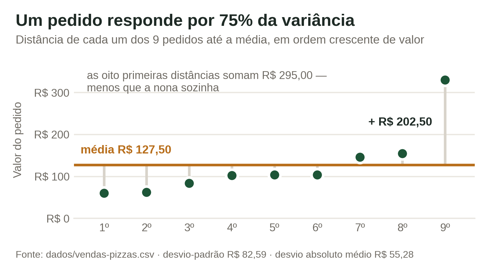

O gráfico mostra de onde vem o número. Oito pedidos ficam perto da média; o nono está R\$ 202,50 acima dela. Como a fórmula eleva cada distância ao quadrado, esse único pedido responde por 75% da soma final.


Repare que dividimos por $$n-1$$, e não por $$n$$. Isso vale quando os dados são uma **amostra** — um pedaço do todo, como nove pedidos de um dia inteiro. Quando você tem a população completa, divide por $$n$$. No Google Planilhas, `DESVPAD` divide por $$n-1$$ e `DESVPADP` divide por $$n$$. Na dúvida, use `DESVPAD`.


## Desvio absoluto médio

Elevar ao quadrado resolve o problema dos sinais, mas dá peso enorme às distâncias grandes: o pedido de R\$ 330,00 sozinho respondeu por 75% da soma dos quadrados.

O **desvio absoluto médio** (MAD, de *mean absolute deviation*) usa o valor absoluto no lugar do quadrado:

$$
MAD = \frac{\sum_{i=1}^{n}|x_i - \bar{x}|}{n}
$$

As barras verticais $$|\;|$$ significam "ignore o sinal": $$|-67{,}50| = 67{,}50$$. O resto é igual: $$x_i$$ é cada valor, $$\bar{x}$$ é a média, $$n$$ é a quantidade.

Exemplo com os mesmos nove pedidos. Soma das distâncias sem sinal:

67,50 + 65,00 + 43,75 + 25,00 + 23,75 + 23,75 + 18,75 + 27,50 + 202,50 = 497,50

$$
MAD = \frac{497{,}50}{9} = 55{,}28
$$

O MAD é R\$ 55,28, contra R\$ 82,59 do desvio-padrão. Os dois medem a mesma coisa, mas o desvio-padrão é maior porque castiga mais o pedido de R\$ 330,00.

Quando os dois números se afastam, é sinal de que existem valores extremos no conjunto.

## Coeficiente de variação

Um desvio-padrão de R\$ 82,59 é grande ou pequeno? Depende do tamanho dos números envolvidos. R\$ 82,59 de variação é enorme para o preço de uma fatia e irrelevante para o faturamento anual.

O **coeficiente de variação** resolve isso dividindo o desvio-padrão pela média:

$$
CV = \frac{s}{\bar{x}}
$$

Aqui, $$s$$ é o desvio-padrão e $$\bar{x}$$ é a média. O resultado não tem unidade — é uma proporção, que costuma ser lida em porcentagem.

Exemplo com os nove pedidos:

$$
CV = \frac{82{,}59}{127{,}50} = 0{,}648 = 64{,}8\%
$$

Agora a comparação fica possível. Nos dados completos:

| Variável | Média | Desvio-padrão | CV |
| --- | --- | --- | --- |
| Valor do pedido | R\$ 191,54 | R\$ 153,24 | 80,0% |
| Preço de uma pizza G | R\$ 99,01 | R\$ 7,61 | 7,7% |

O preço da pizza grande é previsível: varia menos de 8% em torno da média. O valor do pedido é imprevisível: varia 80%. Faz sentido — o cardápio fixa o preço da pizza, mas o cliente decide quantas leva.


Use o CV sempre que precisar comparar a variabilidade de coisas em escalas diferentes: faturamento de uma loja grande contra o de uma pequena, ou tempo de entrega em minutos contra valor do pedido em reais.


## Quartis

Os **quartis** cortam a lista ordenada em quatro partes iguais, com 25% dos dados em cada uma.

- **Q1** (primeiro quartil): 25% dos valores estão abaixo dele
- **Q2** (segundo quartil): é a própria mediana, 50% abaixo
- **Q3** (terceiro quartil): 75% dos valores estão abaixo dele

Nos nove pedidos, cada quartil cai numa posição da lista ordenada. Com nove valores, Q1 fica na 3ª posição, Q2 na 5ª e Q3 na 7ª:

| Posição | 1º | 2º | 3º | 4º | 5º | 6º | 7º | 8º | 9º |
| --- | --- | --- | --- | --- | --- | --- | --- | --- | --- |
| Valor (R\$) | 60,00 | 62,50 | 83,75 | 102,50 | 103,75 | 103,75 | 146,25 | 155,00 | 330,00 |
| Quartil | | | **Q1** | | **Q2** | | **Q3** | | |

Então Q1 = R\$ 83,75, Q2 = R\$ 103,75 e Q3 = R\$ 146,25.

Leitura prática: um quarto dos pedidos daquela noite ficou abaixo de R\$ 83,75, e um quarto passou de R\$ 146,25.

## Amplitude interquartil

A **amplitude interquartil** (IQR, de *interquartile range*) é a distância entre Q3 e Q1:

$$
IQR = Q_3 - Q_1
$$

Nos nove pedidos:

$$
IQR = 146{,}25 - 83{,}75 = 62{,}50
$$

O IQR é R\$ 62,50. Ele mede a largura da metade central dos dados — os 50% que sobram depois de descartar o quarto mais barato e o quarto mais caro.

Compare com a amplitude simples do mesmo conjunto, R\$ 270,00. A amplitude enxerga o pedido de R\$ 330,00; o IQR não. Por isso o IQR é a medida de dispersão preferida quando existem valores extremos.

## Box-plot

O **box-plot** (ou gráfico de caixa) desenha cinco números de uma vez: mínimo, Q1, mediana, Q3 e máximo. Foi criado por John Tukey em 1969 e continua sendo a forma mais rápida de comparar distribuições.

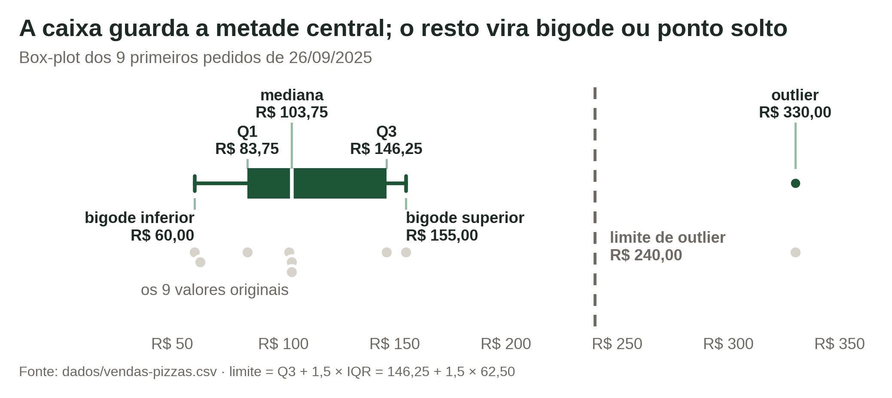

A caixa vai de Q1 a Q3, então o comprimento dela é o IQR. O traço branco dentro da caixa é a mediana. Os bigodes esticam até o menor e o maior valor que ainda são considerados normais. O que passa disso vira ponto solto.

A posição da mediana dentro da caixa também informa. Nos nove pedidos, a mediana (R\$ 103,75) está mais perto da base (R\$ 83,75) do que do topo (R\$ 146,25). Isso indica assimetria à direita — o mesmo que o histograma mostrou.

## Outliers

**Outlier** é um valor muito distante do resto do conjunto. O box-plot marca outliers por uma regra fixa, baseada no IQR:

$$
\text{limite inferior} = Q_1 - 1{,}5 \times IQR
$$

$$
\text{limite superior} = Q_3 + 1{,}5 \times IQR
$$

Aqui, $$Q_1$$ e $$Q_3$$ são o primeiro e o terceiro quartil, e $$IQR$$ é a distância entre eles. Tudo que ficar fora desses dois limites é outlier.

Exemplo com os nove pedidos, onde Q1 = 83,75, Q3 = 146,25 e IQR = 62,50:

$$
\text{limite inferior} = 83{,}75 - 1{,}5 \times 62{,}50 = 83{,}75 - 93{,}75 = -10{,}00
$$

$$
\text{limite superior} = 146{,}25 + 1{,}5 \times 62{,}50 = 146{,}25 + 93{,}75 = 240{,}00
$$

Nenhum pedido fica abaixo de −R\$ 10,00, então não há outlier inferior. Um pedido passa de R\$ 240,00: o de R\$ 330,00. Ele é o único outlier daquela noite.

Nos 21.350 pedidos completos, a mesma regra dá limite superior de R\$ 484,13 e marca 588 pedidos como outliers — 2,7% do total. São as festas e encomendas grandes, com o maior chegando a R\$ 2.221,00.

> "O impacto dos outliers pode ser enorme para muitos algoritmos, especialmente os que trabalham com regressão. Isso significa que você deve prestar atenção especial à detecção de outliers no seu conjunto de dados."
> — Tobias Zwingmann, *AI-Powered Business Intelligence*


Outlier não é sinônimo de erro. Um pedido de R\$ 2.221,00 pode ser uma festa de empresa — cliente valioso, dado correto. Um pedido de R\$ −50,00 é erro. Investigue antes de apagar qualquer coisa: às vezes o outlier é o dado mais interessante da planilha.


## Comparando distribuições com box-plots

O box-plot brilha quando você coloca vários lado a lado no mesmo eixo. Compare o preço unitário das pizzas por tamanho:

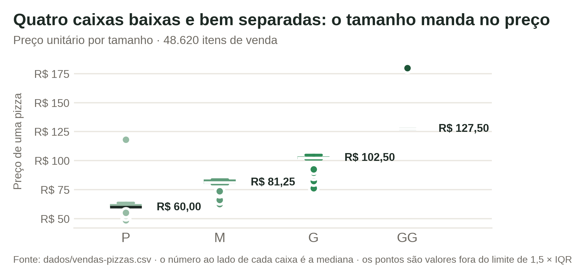

| Tamanho | Pizzas vendidas | Q1 | Mediana | Q3 | IQR |
| --- | --- | --- | --- | --- | --- |
| P | 14.137 | R\$ 60,00 | R\$ 60,00 | R\$ 62,50 | R\$ 2,50 |
| M | 15.385 | R\$ 80,00 | R\$ 81,25 | R\$ 83,75 | R\$ 3,75 |
| G | 18.526 | R\$ 101,25 | R\$ 102,50 | R\$ 103,75 | R\$ 2,50 |
| GG | 572 | R\$ 127,50 | R\$ 127,50 | R\$ 127,50 | R\$ 0,00 |

Quatro caixas, três conclusões imediatas. As caixas sobem de P para GG, então os tamanhos têm faixas de preço bem separadas. Todas as caixas são baixas, então o preço varia pouco dentro de cada tamanho. A caixa do GG tem altura zero: 95% das pizzas GG custaram exatamente R\$ 127,50.

## Decis e percentis

Quartis cortam os dados em 4 partes. **Decis** cortam em 10 partes, e **percentis** em 100.

O nome já diz a posição. O 1º decil (D1) deixa 10% dos valores abaixo dele. O percentil 90 (P90) deixa 90% dos valores abaixo. Um decil vale 10 percentis: D1 é o mesmo que P10, D9 é o mesmo que P90, e a mediana é P50.

Nos nove pedidos, o D1 cai entre o 1º valor (R\$ 60,00) e o 2º (R\$ 62,50), mais perto do primeiro: R\$ 62,00. O D9 cai entre o 8º (R\$ 155,00) e o 9º (R\$ 330,00), mais perto do oitavo: R\$ 190,00.

Com poucos valores, decis dizem pouco. O poder deles aparece em conjuntos grandes. Nos 21.350 pedidos:

| Medida | Valor | Leitura |
| --- | --- | --- |
| P25 (Q1) | R\$ 89,75 | um quarto dos pedidos fica abaixo disso |
| P50 (mediana) | R\$ 162,50 | metade dos pedidos fica abaixo disso |
| P75 (Q3) | R\$ 247,50 | três quartos ficam abaixo disso |
| P90 | R\$ 333,75 | só 10% dos pedidos passam disso |
| P95 | R\$ 375,00 | só 5% dos pedidos passam disso |

Existe um gráfico feito para ler percentis: a **curva do acumulado**. No eixo horizontal vai o valor do pedido; no vertical, a porcentagem de pedidos que fica até ali. Para achar qualquer percentil, escolha a altura, ande até a curva e desça.

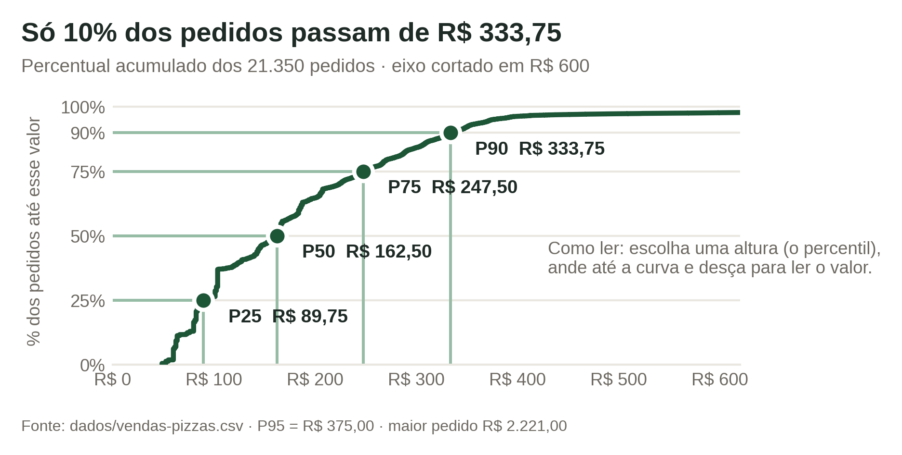

A curva sobe rápido até uns R\$ 250,00 e depois quase deita. Essa parte deitada é a cauda: poucos pedidos, espalhados por uma faixa enorme de valores.

Percentis viram decisões diretas. Se a pizzaria quiser criar um programa de fidelidade para os 10% maiores pedidos, o corte é R\$ 333,75. Se quiser dimensionar a cozinha para o pior caso rotineiro, o P95 (R\$ 375,00) é um alvo melhor que o máximo absoluto de R\$ 2.221,00 — que aconteceu uma vez em um ano e meio.


Percentis também servem para posicionar um caso individual. Um pedido de R\$ 250,00 está acima de aproximadamente 75% dos pedidos da casa. Dizer isso é mais informativo que dizer "R\$ 250,00".


## Fazendo as contas no Google Planilhas

Todas as medidas desta aula existem como função pronta. Supondo que os valores dos pedidos estejam no intervalo `B2:B10`:

| Medida | Fórmula |
| --- | --- |
| Média | `=MÉDIA(B2:B10)` |
| Mediana | `=MED(B2:B10)` |
| Moda | `=MODO(B2:B10)` |
| Mínimo e máximo | `=MÍNIMO(B2:B10)` e `=MÁXIMO(B2:B10)` |
| Amplitude | `=MÁXIMO(B2:B10)-MÍNIMO(B2:B10)` |
| Variância | `=VAR(B2:B10)` |
| Desvio-padrão | `=DESVPAD(B2:B10)` |
| MAD | `=DESV.MÉDIO(B2:B10)` |
| Coeficiente de variação | `=DESVPAD(B2:B10)/MÉDIA(B2:B10)` |
| Q1 e Q3 | `=QUARTIL(B2:B10;1)` e `=QUARTIL(B2:B10;3)` |
| IQR | `=QUARTIL(B2:B10;3)-QUARTIL(B2:B10;1)` |
| Decil 9 | `=PERCENTIL(B2:B10;0,9)` |
| Percentil de um valor | `=ORDEM.PORCENTUAL(B2:B10;250)` |

Para o histograma, selecione a coluna, vá em **Inserir → Gráfico** e escolha o tipo **Histograma**. Depois, em **Personalizar → Histograma**, ajuste o tamanho do balde até o desenho ficar legível.

Para o box-plot, o Google Planilhas não tem um tipo pronto. Calcule os cinco números com as fórmulas acima e monte um gráfico de barras empilhadas, ou use um gráfico de velas (*candlestick*).


Existem métodos diferentes de calcular quartis, e programas distintos podem devolver valores levemente diferentes para o mesmo conjunto. `QUARTIL` e `PERCENTIL` do Google Planilhas usam o mesmo método adotado nesta aula. Mantenha um só método do começo ao fim de uma análise.


## O pacote mínimo de uma análise

Nunca entregue uma medida sozinha. Um resumo honesto de uma variável contínua tem sempre três partes: um número de centro, um número de dispersão e uma olhada na forma.

Para o valor dos pedidos da pizzaria, o pacote mínimo é este:

| O que | Valor | O que diz |
| --- | --- | --- |
| Mediana | R\$ 162,50 | o pedido típico |
| Média | R\$ 191,54 | puxada para cima pelas festas |
| IQR | R\$ 157,75 | largura da metade central |
| Desvio-padrão | R\$ 153,24 | espalhamento em torno da média |
| Mín e máx | R\$ 48,75 e R\$ 2.221,00 | os extremos observados |
| Outliers | 588 pedidos (2,7%) | acima de R\$ 484,13 |
| Forma | assimétrica à direita | média acima da mediana |

Sete linhas descrevem 21.350 pedidos sem esconder nada relevante. Esse é o objetivo da estatística descritiva.

## Bibliografia

Braghittoni, R. (2017). *Business Intelligence: implementar do jeito certo e a custo zero*. Casa do Código.

Sharda, R., Delen, D., & Turban, E. (2024). *Business intelligence, analytics, data science, and AI: A managerial perspective* (5th ed.). Pearson.

Zwingmann, T. (2022). *AI-powered business intelligence*. O'Reilly Media.

> **Nota sobre o uso de IA:** este material foi produzido com apoio de inteligência artificial (Claude), a partir dos livros listados na bibliografia e dos dados fornecidos pelo professor.
>
