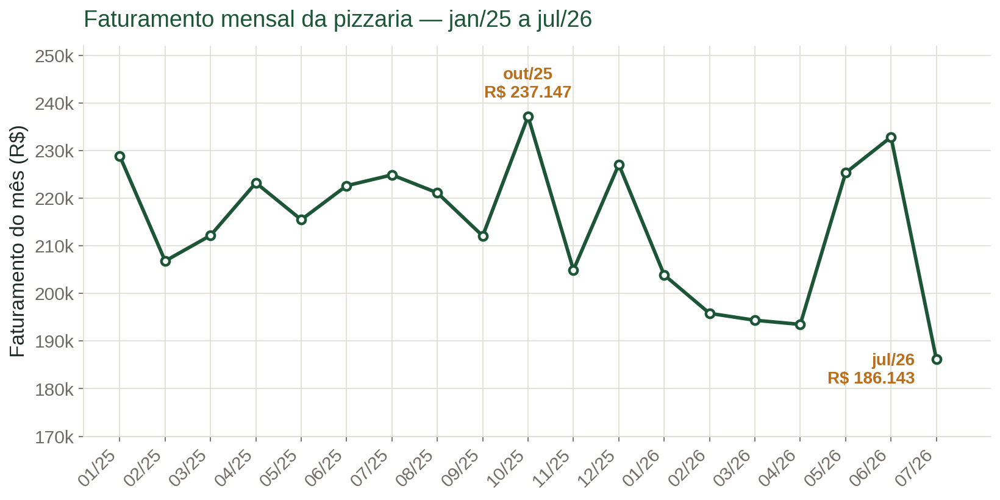
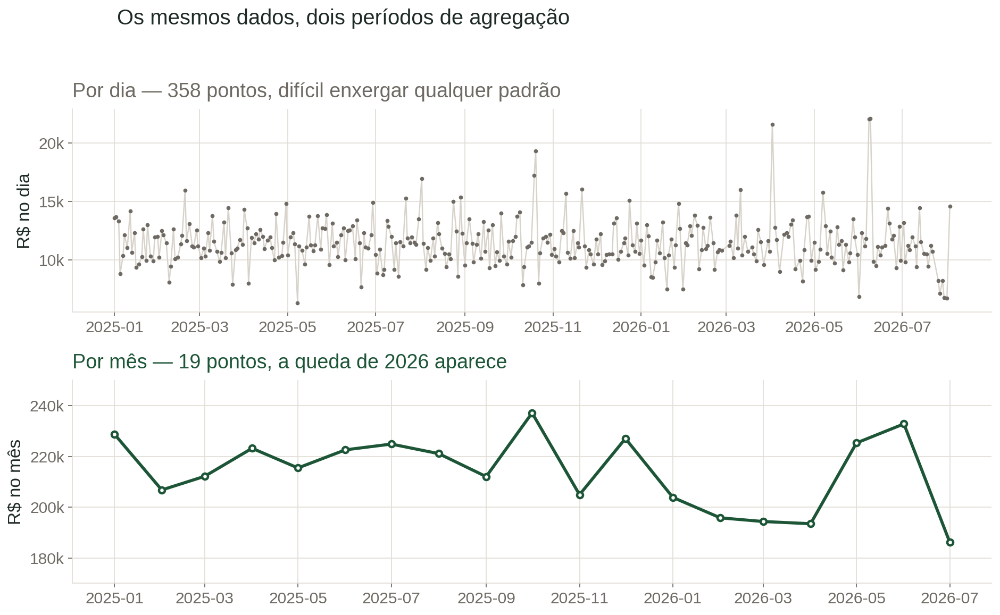
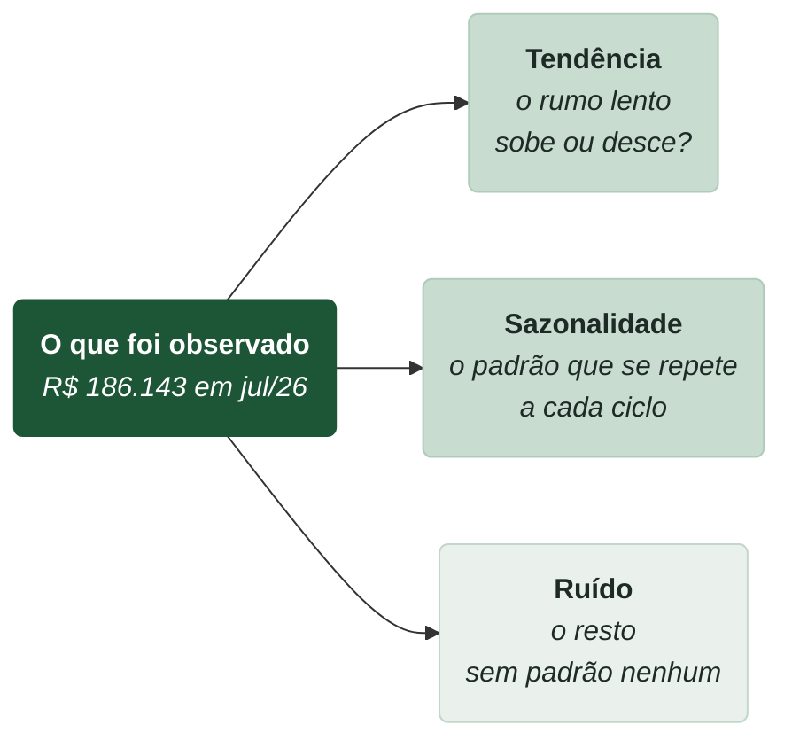
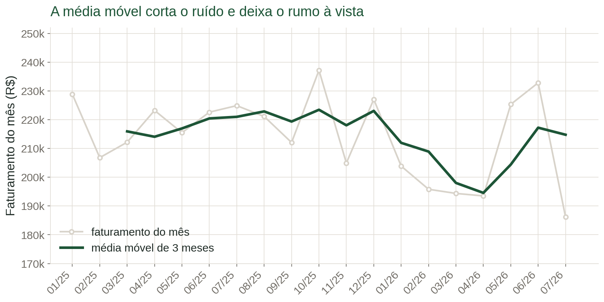
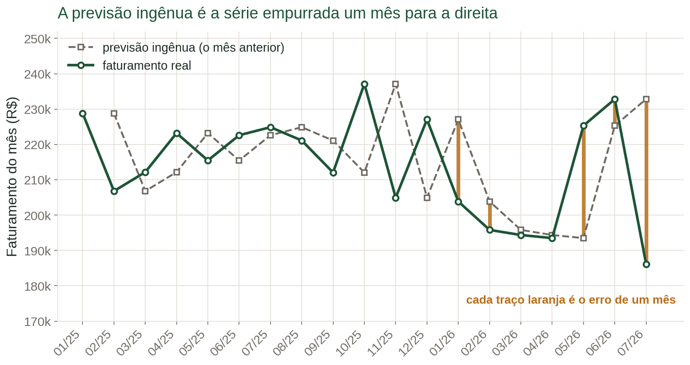
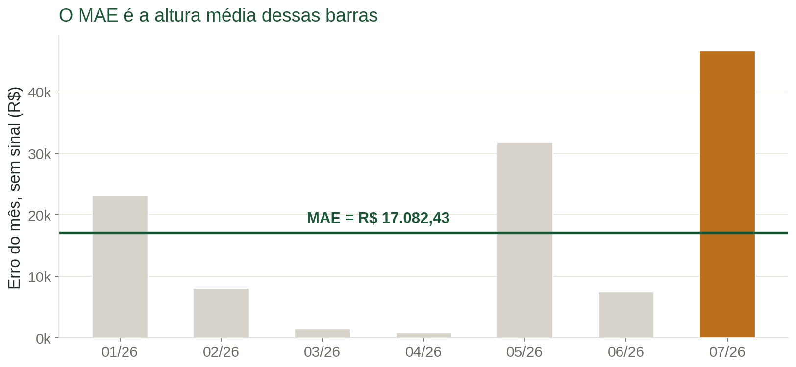
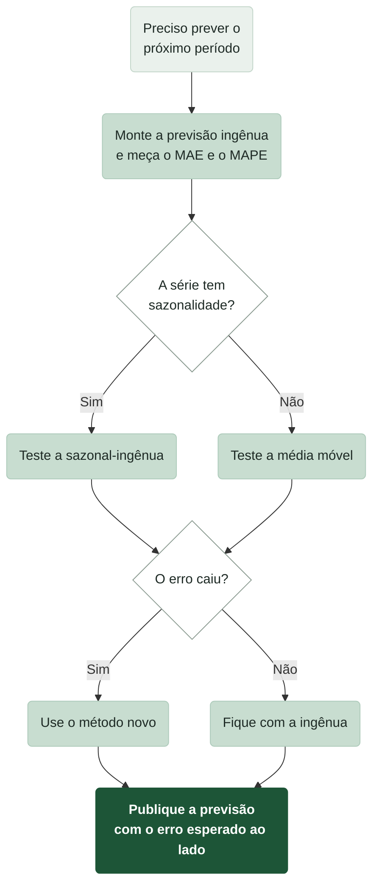

# Aula 5 — Séries Temporais e Previsão

Nas aulas anteriores você resumiu os pedidos da pizzaria com médias, medianas e histogramas. Todas aquelas contas jogaram fora uma informação: a ordem.

Um pedido de R\$ 330,00 feito em janeiro de 2025 e outro feito em julho de 2026 entram na mesma média. Para a média, tanto faz qual veio primeiro. Mas para o Vitto faz toda a diferença. Ele não quer saber quanto a pizzaria vendeu em média nos últimos dezoito meses. Ele quer saber quanto vai vender no mês que vem, para decidir quanta farinha comprar e quantos entregadores escalar.

Responder isso exige olhar os dados na ordem em que aconteceram. Quem trabalha com dados de negócio aprende cedo que essa coluna é a mais importante da tabela:

> "Variável com o tempo: talvez seja esse o ponto-chave do DW. Sempre, invariavelmente e de qualquer forma, as informações devem ser posicionadas no tempo."
> — Ronaldo Braghittoni, *Business Intelligence: implementar do jeito certo e a custo zero*

Na base da pizzaria essa coluna é a `data_pedido`. Até aqui ela só serviu para filtrar. Nesta aula ela vira o eixo da análise.

## O que é uma série temporal

Uma **série temporal** é a mesma medida, repetida em intervalos regulares, guardada na ordem do tempo.

> "Uma série temporal é uma sequência de pontos de dados da variável de interesse, medidos e representados em pontos sucessivos no tempo, espaçados em intervalos uniformes."
> — Ramesh Sharda, Dursun Delen e Efraim Turban, *Business Intelligence, Analytics, Data Science, and AI*

Três coisas precisam ser verdade ao mesmo tempo: é sempre a mesma medida, os intervalos são iguais, e a ordem importa.

O faturamento mensal da pizzaria atende às três. É sempre "reais vendidos", sempre um mês inteiro, e janeiro vem antes de fevereiro. Aqui estão os 19 meses completos da base, de janeiro de 2025 a julho de 2026:

| Mês | Faturamento | Mês | Faturamento |
| --- | --- | --- | --- |
| 01/25 | R\$ 228.818,25 | 11/25 | R\$ 204.926,75 |
| 02/25 | R\$ 206.797,75 | 12/25 | R\$ 227.060,00 |
| 03/25 | R\$ 212.160,75 | 01/26 | R\$ 203.861,00 |
| 04/25 | R\$ 223.207,25 | 02/26 | R\$ 195.808,50 |
| 05/25 | R\$ 215.464,00 | 03/26 | R\$ 194.363,00 |
| 06/25 | R\$ 222.603,75 | 04/26 | R\$ 193.493,00 |
| 07/25 | R\$ 224.875,50 | 05/26 | R\$ 225.314,25 |
| 08/25 | R\$ 221.109,00 | 06/26 | R\$ 232.823,00 |
| 09/25 | R\$ 212.055,75 | 07/26 | R\$ 186.143,00 |
| 10/25 | R\$ 237.146,75 | | |

Série temporal se desenha em linha, nunca em barras separadas. A linha existe justamente para dizer "estes pontos estão ligados, um puxa o outro".


A base vai até 3 de agosto de 2026, então agosto tem só três dias de venda. Um mês pela metade não é comparável com um mês inteiro. Descartamos agosto e trabalhamos com 19 meses completos. Período incompleto no fim da série é o erro mais comum em análise temporal: ele sempre parece uma queda dramática.


## O período muda o que você enxerga

Os dados brutos da pizzaria não são mensais. São 48.620 linhas de venda, cada uma com data e hora. Você é quem decide o intervalo da série: hora, dia, semana, mês.

Essa escolha não é detalhe. Ela decide o que você consegue ver.

O gráfico de cima é o faturamento diário: 358 dias com venda, pulando entre R\$ 6 mil e R\$ 22 mil. É uma serra. Nenhum padrão salta aos olhos.

O gráfico de baixo é o mesmo dinheiro, somado por mês. Agora dá para ver que 2026 vende menos que 2025.

Nada foi inventado entre um gráfico e outro. Somar os dias de um mês cancela parte do sobe-e-desce diário e deixa o movimento lento aparecer.


Escolha o período pela decisão que você precisa tomar. Vai comprar farinha para o mês? Série mensal. Vai escalar gente para o turno da noite? Série por hora. Não existe período "certo" fora de contexto.


## As três partes de uma série

Qualquer série temporal pode ser separada em três pedaços que se somam.

**Tendência** é o rumo geral, o movimento lento que atravessa vários períodos. **Sazonalidade** é o padrão que se repete em ciclo fixo: todo dia na mesma hora, todo ano no mesmo mês. **Ruído** é o que sobra depois de tirar os dois — o acaso do dia a dia.

Separar as três coisas chama-se **decomposição**. Veja a série da pizzaria repartida:

Prever é apostar que a tendência e a sazonalidade continuam. O ruído, por definição, ninguém prevê.

## Tendência: para onde a coisa vai

A tendência da pizzaria é de queda. Dá para provar isso com uma conta simples: comparar o mesmo pedaço do ano nos dois anos.

- Janeiro a julho de 2025: R\$ 1.533.927,25
- Janeiro a julho de 2026: R\$ 1.431.805,75

A diferença é R\$ 102.121,50 a menos. Em porcentagem:

$$
\frac{1\,431\,805{,}75 - 1\,533\,927{,}25}{1\,533\,927{,}25} = -0{,}0666 = -6{,}7\%
$$

A pizzaria vendeu 6,7% menos nos sete primeiros meses de 2026 do que nos sete primeiros de 2025.

Comparar os mesmos meses nos dois anos é o truque que evita a armadilha da sazonalidade. Se você comparasse "os últimos sete meses" contra "os sete anteriores", estaria misturando meses de verão com meses de inverno, e não saberia se a diferença é tendência ou estação.

## Sazonalidade: o padrão que se repete

Na série mensal da pizzaria não há sazonalidade visível. Mas dentro do dia há, e é enorme.

Somando o faturamento de cada hora e dividindo pelos 358 dias com venda, aparece o perfil de um dia típico:

O gráfico da esquerda tem dois morros: o almoço, entre 12h e 13h, e o jantar, entre 17h e 18h. Entre eles, às 15h, a casa esvazia. Esse desenho se repete todo dia. É sazonalidade.

Para usar isso numa previsão, transforme cada hora em um número: o **índice sazonal**.

$$
I_h = \frac{\bar{x}_h}{\bar{x}}
$$

Aqui, $$\bar{x}_h$$ é o faturamento médio daquela hora, $$\bar{x}$$ é o faturamento médio de todas as horas, e $$I_h$$ é o índice da hora — quantas vezes aquela hora vale, comparada a uma hora comum.

Exemplo com as 12h. O faturamento médio das 12h é R\$ 1.562,54, e a média das doze horas de funcionamento é R\$ 950,13:

$$
I_{12} = \frac{1\,562{,}54}{950{,}13} = 1{,}645
$$

O horário do almoço vale 1,645 vezes uma hora comum, ou seja, 64,5% acima da média. Os índices das doze horas:

| Hora | Faturamento médio | Índice | Hora | Faturamento médio | Índice |
| --- | --- | --- | --- | --- | --- |
| 11h | R\$ 627,59 | 0,661 | 17h | R\$ 1.204,43 | 1,268 |
| 12h | R\$ 1.562,54 | 1,645 | 18h | R\$ 1.247,16 | 1,313 |
| 13h | R\$ 1.481,36 | 1,559 | 19h | R\$ 1.014,37 | 1,068 |
| 14h | R\$ 826,84 | 0,870 | 20h | R\$ 813,06 | 0,856 |
| 15h | R\$ 740,12 | 0,779 | 21h | R\$ 587,01 | 0,618 |
| 16h | R\$ 978,43 | 1,030 | 22h | R\$ 318,65 | 0,335 |

Índice acima de 1 é hora de pico. Abaixo de 1, hora fraca.

Agora o índice vira escala de pessoal. Suponha que o Vitto espere R\$ 12.000,00 de faturamento amanhã. Divididos pelas doze horas de funcionamento, isso dá R\$ 1.000,00 por hora em média. A previsão de cada hora é essa média multiplicada pelo índice:

$$
12\text{h}: 1\,000{,}00 \times 1{,}645 = 1\,645{,}00
$$

$$
22\text{h}: 1\,000{,}00 \times 0{,}335 = 335{,}00
$$

Entre meio-dia e uma da tarde devem entrar cerca de R\$ 1.645,00; entre dez e onze da noite, cerca de R\$ 335,00. Cinco vezes menos. A cozinha das 12h precisa de outro tamanho de equipe que a das 22h.


Nem toda série tem sazonalidade. O gráfico da direita, ali em cima, é o faturamento médio por dia da semana: sete barras quase idênticas, entre R\$ 11.093 e R\$ 11.756, com a média em R\$ 11.423. A diferença entre o melhor e o pior dia da semana é de 6%, dentro do que o acaso explica. Nesta pizzaria, sábado não vende mais que terça. Teste antes de assumir que existe padrão — supor sazonalidade que não existe piora a previsão.


## Ruído: o que sobra

Depois de tirar tendência e sazonalidade, sobra o ruído: o terceiro painel do gráfico de decomposição, barras para cima e para baixo sem ordem nenhuma.

Ruído não é erro de medição. É a soma de mil causas pequenas demais para rastrear — choveu, um cliente cancelou, uma empresa da rua encomendou trinta pizzas.

A regra prática é dura e útil: **ruído não se prevê**. Se sua previsão acerta o ruído, ela não está prevendo, está decorando o passado. Toda previsão honesta erra, e o erro é mais ou menos do tamanho do ruído.

## Média móvel

A **média móvel** é a ferramenta que separa rumo de barulho. Em vez de olhar cada mês sozinho, você olha a média dos últimos meses e vai deslizando essa janela para a frente.

$$
MM_k(t) = \frac{x_t + x_{t-1} + \dots + x_{t-k+1}}{k}
$$

Aqui, $$x_t$$ é o valor do período atual, $$k$$ é o tamanho da janela (quantos períodos entram na média), e $$MM_k(t)$$ é a média móvel de $$k$$ períodos calculada no período $$t$$.

Exemplo com janela de 3 meses, calculada em julho de 2026. Entram julho, junho e maio:

$$
MM_3 = \frac{186\,143{,}00 + 232\,823{,}00 + 225\,314{,}25}{3} = \frac{644\,280{,}25}{3} = 214\,760{,}08
$$

A média móvel de julho é R\$ 214.760,08, contra R\$ 186.143,00 do mês isolado. O tombo de julho encolhe quando dividido com os dois meses vizinhos.

Repetindo a conta mês a mês, sai uma linha bem mais calma que a original:

O tamanho da janela é escolha sua, e envolve uma troca. Janela pequena acompanha bem as mudanças, mas ainda balança. Janela grande alisa mais, porém demora a perceber que algo mudou. Uma média móvel de 12 meses só notaria a queda de 2026 quase no fim do ano.


Quando existe sazonalidade, use janela do tamanho exato do ciclo: 12 para série mensal com ciclo anual, 7 para série diária com ciclo semanal. Assim cada janela contém um ciclo completo e a sazonalidade se cancela sozinha, deixando só a tendência.


## Previsão ingênua

Chegou a hora de prever. Comece pelo método mais simples que existe: a **previsão ingênua**, que chuta que o próximo período será igual ao último.

$$
\hat{y}_{t+1} = y_t
$$

Aqui, $$y_t$$ é o valor observado no período atual e $$\hat{y}_{t+1}$$ (lido "y-chapéu") é a previsão para o próximo período. O chapéu marca que aquilo é previsão, não observação.

Exemplo: julho de 2026 fechou em R\$ 186.143,00. A previsão ingênua para agosto de 2026 é R\$ 186.143,00.

Parece preguiça, e é. Mas ela tem uma função séria:

> "As técnicas usadas para desenvolver previsões de séries temporais vão desde as muito simples — a previsão ingênua, que sugere que a previsão de hoje é igual ao valor real de ontem — até as muito complexas, como o ARIMA."
> — Ramesh Sharda, Dursun Delen e Efraim Turban, *Business Intelligence, Analytics, Data Science, and AI*

A previsão ingênua é a régua. Qualquer método mais sofisticado precisa ganhar dela, senão não vale o trabalho.

Desenhada sobre a série, ela é a linha original empurrada um mês para a direita:

Cada traço laranja é o erro de um mês. Repare que os traços são curtos quando a série anda de lado e enormes quando ela vira — em julho de 2026 a previsão errou por quase R\$ 47 mil. Toda previsão ingênua chega atrasada nas viradas.

## Previsão sazonal-ingênua

Quando a série tem sazonalidade, repetir o período anterior atrapalha: você prevê dezembro com o valor de novembro. A **previsão sazonal-ingênua** corrige isso repetindo o mesmo período do ciclo anterior.

$$
\hat{y}_{t+1} = y_{t+1-m}
$$

Aqui, $$m$$ é o tamanho do ciclo: 12 para série mensal com ciclo anual, 7 para série diária com ciclo semanal. A previsão de um mês é o que aconteceu nesse mesmo mês, um ciclo atrás.

Exemplo: para prever agosto de 2026 com $$m = 12$$, use agosto de 2025, que fechou em R\$ 221.109,00.

Duas previsões, dois números bem diferentes para o mesmo mês: R\$ 186.143,00 pela ingênua e R\$ 221.109,00 pela sazonal-ingênua. Falta decidir em qual acreditar — e para isso é preciso medir.

## Medir o erro: o MAE

O **erro** de uma previsão é a diferença entre o que aconteceu e o que você tinha previsto. Erro positivo significa que vendeu mais que o previsto; negativo, menos.

Erros positivos e negativos se cancelam quando somados, então uma previsão terrível pode dar erro médio zero. A saída é ignorar o sinal antes de somar. Isso é o **erro absoluto médio** (MAE, de *mean absolute error*):

$$
MAE = \frac{1}{n}\sum_{i=1}^{n}|y_i - \hat{y}_i|
$$

Aqui, $$y_i$$ é o valor real de cada período, $$\hat{y}_i$$ é a previsão daquele período, as barras $$|\;|$$ mandam ignorar o sinal, e $$n$$ é quantos períodos você está avaliando.

Exemplo com a previsão ingênua nos sete meses de 2026:

| Mês | Real | Previsão ingênua | Erro | Erro sem sinal |
| --- | --- | --- | --- | --- |
| 01/26 | R\$ 203.861,00 | R\$ 227.060,00 | −23.199,00 | 23.199,00 |
| 02/26 | R\$ 195.808,50 | R\$ 203.861,00 | −8.052,50 | 8.052,50 |
| 03/26 | R\$ 194.363,00 | R\$ 195.808,50 | −1.445,50 | 1.445,50 |
| 04/26 | R\$ 193.493,00 | R\$ 194.363,00 | −870,00 | 870,00 |
| 05/26 | R\$ 225.314,25 | R\$ 193.493,00 | +31.821,25 | 31.821,25 |
| 06/26 | R\$ 232.823,00 | R\$ 225.314,25 | +7.508,75 | 7.508,75 |
| 07/26 | R\$ 186.143,00 | R\$ 232.823,00 | −46.680,00 | 46.680,00 |
| | | | **Soma** | **119.577,00** |

$$
MAE = \frac{119\,577{,}00}{7} = 17\,082{,}43
$$

O MAE é R\$ 17.082,43. Leitura prática: prevendo desse jeito, o Vitto erra cerca de R\$ 17 mil por mês, para mais ou para menos.

O MAE é a altura média dessas barras. Ele fica em reais, na mesma unidade dos dados, e é por isso que se explica fácil para quem não é da área.

## Medir o erro em porcentagem: o MAPE

R\$ 17.082,43 de erro é muito ou pouco? Depende do tamanho da pizzaria. Errar R\$ 17 mil num faturamento de R\$ 200 mil é diferente de errar R\$ 17 mil num faturamento de R\$ 20 milhões.

O **erro percentual absoluto médio** (MAPE, de *mean absolute percentage error*) resolve isso dividindo cada erro pelo valor real antes de tirar a média:

$$
MAPE = \frac{1}{n}\sum_{i=1}^{n}\frac{|y_i - \hat{y}_i|}{y_i} \times 100\%
$$

Os símbolos são os mesmos do MAE. A novidade é a divisão por $$y_i$$, que transforma cada erro em uma fração do valor real daquele mês.

Exemplo com os mesmos sete meses. O erro de janeiro, R\$ 23.199,00, sobre o real de janeiro, R\$ 203.861,00:

$$
\frac{23\,199{,}00}{203\,861{,}00} = 0{,}1138 = 11{,}38\%
$$

Repetindo mês a mês:

| Mês | 01/26 | 02/26 | 03/26 | 04/26 | 05/26 | 06/26 | 07/26 |
| --- | --- | --- | --- | --- | --- | --- | --- |
| Erro % | 11,38% | 4,11% | 0,74% | 0,45% | 14,12% | 3,23% | 25,08% |

$$
MAPE = \frac{59{,}11\%}{7} = 8{,}44\%
$$

A previsão ingênua erra, em média, 8,44% do faturamento do mês. Agora o número pode ser comparado com o de qualquer outra pizzaria, de qualquer tamanho.


O MAPE quebra quando o valor real é zero — divisão por zero — e fica gigante quando o valor real é muito pequeno. Não use MAPE em séries que passam perto do zero, como vendas de um produto que às vezes não vende nada no mês. Nesses casos, fique com o MAE.


## Qual método usar

Com MAE e MAPE na mão, a escolha do método deixa de ser opinião. Rode os três candidatos nos mesmos sete meses de 2026 e compare:

| Método | Previsão de cada mês | MAE | MAPE |
| --- | --- | --- | --- |
| **Ingênua** | o mês anterior | **R\$ 17.082,43** | **8,44%** |
| Sazonal-ingênua | o mesmo mês de 2025 | R\$ 20.322,93 | 10,28% |
| Média móvel de 3 meses | média dos 3 meses anteriores | R\$ 20.664,05 | 10,00% |

A previsão ingênua ganhou das outras duas. Não é acidente: já vimos que esta série não tem sazonalidade mensal, então repetir o mês do ano passado só adiciona ruído velho. E a média móvel, que alisa bem, reage devagar demais quando a série vira.

O resultado é desconfortável e é a lição principal desta aula: **o método mais complicado não é automaticamente o melhor.** Ele só é melhor se o erro medido disser que é.


Nunca entregue uma previsão sozinha. Entregue sempre o par: o número e o erro esperado. "Agosto deve fechar em R\$ 186.143,00, com erro típico de R\$ 17 mil" é uma informação que o Vitto pode usar para decidir. "Agosto vai fechar em R\$ 186.143,00" é um chute disfarçado de certeza.


## Fazendo as contas no Google Planilhas

Tudo desta aula sai em uma planilha, sem nenhuma ferramenta especial.

Primeiro, agregue por período. Com as datas na coluna `A` e os valores na `B`, crie uma coluna de mês com `=TEXTO(A2;"aaaa-mm")` e some com uma tabela dinâmica, ou use `=SOMASE`. Ordene por mês antes de qualquer outra coisa — série fora de ordem produz gráfico sem sentido.

Depois, com os faturamentos mensais na coluna `B`, a partir da linha 2:

| O que | Fórmula | Onde colocar |
| --- | --- | --- |
| Média móvel de 3 meses | `=MÉDIA(B2:B4)` | linha 4, arrastando para baixo |
| Previsão ingênua | `=B2` | linha 3, arrastando para baixo |
| Previsão sazonal-ingênua | `=B2` | doze linhas abaixo, arrastando |
| Erro | `=B3-C3` | ao lado da previsão |
| Erro sem sinal | `=ABS(B3-C3)` | ao lado do erro |
| Erro percentual | `=ABS(B3-C3)/B3` | formate como porcentagem |
| MAE | `=MÉDIA(E3:E20)` | sobre a coluna de erro sem sinal |
| MAPE | `=MÉDIA(F3:F20)` | sobre a coluna de erro percentual |

Para o gráfico, selecione as colunas de mês e faturamento e vá em **Inserir → Gráfico**, escolhendo o tipo **Linha**. Para comparar real e previsão no mesmo desenho, inclua as duas colunas de valores na seleção.


Cuidado com a data em texto. Se o Google Planilhas mostrar as datas alinhadas à esquerda, elas são texto, não data, e a ordenação vai sair errada — 10/01 aparecendo antes de 02/01. Use **Formatar → Número → Data** e confira se elas passam para a direita.


## O mínimo para entregar uma previsão

Feche o ciclo sempre com as mesmas cinco coisas. Faltando qualquer uma, a previsão não está pronta para virar decisão.

| Passo | No caso da pizzaria |
| --- | --- |
| Escolher o período | mês, porque a compra de insumos é mensal |
| Olhar o gráfico da série | linha de 19 meses, com a queda de 2026 visível |
| Identificar as partes | tendência de queda, sem sazonalidade mensal, muito ruído |
| Escolher o método pelo erro medido | ingênua, com MAE de R\$ 17.082,43 e MAPE de 8,44% |
| Entregar número e erro juntos | agosto/26: R\$ 186.143,00, com erro típico de R\$ 17 mil |

Nada disso exige ARIMA, redes neurais ou aprendizado de máquina. Exige ordenar os dados no tempo, olhar o gráfico e medir o erro antes de confiar.

## Bibliografia

Braghittoni, R. (2017). *Business Intelligence: implementar do jeito certo e a custo zero*. Casa do Código.

Sharda, R., Delen, D., & Turban, E. (2024). *Business intelligence, analytics, data science, and AI: A managerial perspective* (5th ed.). Pearson.

> **Nota sobre o uso de IA:** este material foi produzido com apoio de inteligência artificial (Claude), a partir dos livros listados na bibliografia e dos dados fornecidos pelo professor.
>
