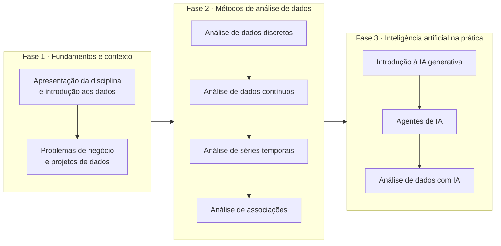

# Roadmap

Nesta disciplina vamos seguir um caminho claro e estruturado: primeiro o contexto, depois os métodos de análise, e só então a inteligência artificial aplicada.

Cada fase resolve um problema da anterior. A Fase 1 explica por que analisar dados muda uma decisão. A Fase 2 entrega as ferramentas para analisar. A Fase 3 usa IA para fazer em minutos o que a Fase 2 faz em horas — e para responder perguntas que a Fase 2 sozinha não alcança.
